# Enrollments 與 Scenarios 完整指南

本文檔詳細說明 Enrollments 和 CoBlocksScenarios 表的設計、用途和整個工作流程。

Last updated: 2026-05-18

---

## 1. 核心概念

### 1.1 Scenario (場景) 是什麼？

**Scenario = 推送場景流程圖**

一個場景是一個**有向無環圖 (DAG)**，定義了：
- 在不同時間點（Day 1, Day 7, Day 14...）
- 應該推送什麼內容給用戶
- 或分配什麼任務、設置什麼屬性

```
Day 1          Day 7           Day 14          Day 28
  │              │               │               │
  ├─ 推送文字      ├─ 推送 Flex    ├─ 分配任務     ├─ 推送卡片
  ├─ 分配任務      ├─ 分配任務     ├─ 增加連勝    └─ 切換菜單
  └─ 設置屬性      └─ AI 生成      └─ 設置屬性
```

### 1.2 Enrollment (加入記錄) 是什麼？

**Enrollment = 用戶在場景的訂閱記錄**

一個 enrollment 記錄表示：
- 某個用戶
- 在某個時間點（enrolled_at）
- 加入了某個場景
- 並開始接收該場景定義的推播

```
用戶 → 加入場景 → Enrollment 被建立 → enrolled_at = 現在
                           ↓
                    Scheduler 每天檢查
                           ↓
         daysSinceEnrollment = 3
                           ↓
          查詢 scenario 的 Day 3 推送節點
                           ↓
         找到節點，執行推送
```

### 1.3 Day 0 的概念

```
enrolled_at = 2026-05-15 10:30 (用戶所在時區)
              ↓
         Day 0 = 2026-05-15 (該天的任何時刻都屬於 Day 0)
         Day 1 = 2026-05-16 (隔日)
         Day 2 = 2026-05-17
         ...
         Day 7 = 2026-05-22
```

**時區感知計算:**
```typescript
daysSinceEnrollment = daysBetweenInTz(enrolled_at, now, user.timezone);
// 考慮用戶的時區，而非 UTC
// 確保全球用戶行為一致
```

---

## 2. 數據庫表詳解

### 2.1 CoBlocksScenario 表

```prisma
model CoBlocksScenario {
  id         String   @id @default(cuid())    // 唯一識別碼
  oa_id      Int                              // 所屬的 LINE OA
  name       String                           // 場景名稱（如「女性療癒課程」）
  flow_nodes Json     @default("[]")          // 流程圖的節點數組
  flow_edges Json     @default("[]")          // 流程圖的邊數組
  is_active  Boolean  @default(false)         // 是否啟用
  created_at DateTime @default(now())
  updated_at DateTime @updatedAt

  oa          LineOA       @relation(fields: [oa_id], references: [id], onDelete: Cascade)
  enrollments Enrollment[]                     // 一對多：此場景的所有加入記錄
}
```

**關鍵字段**:
- `flow_nodes`: 節點數組，包含時序節點、推送節點、AI 節點等
- `flow_edges`: 邊數組，定義節點之間的連接
- `is_active`: 控制該場景是否參與推播和菜單選擇

### 2.2 Enrollment 表

```prisma
model Enrollment {
  id          Int      @id @default(autoincrement())
  user_id     String   @db.VarChar(64)        // 用戶 ID
  scenario_id String   @db.VarChar(30)        // 場景 ID
  enrolled_at DateTime @default(now())        // 用戶加入時間（推播的時間基準）
  status      String   @default("active") @db.VarChar(20)  // 狀態
  created_at  DateTime @default(now())
  updated_at  DateTime @updatedAt

  user     User             @relation(fields: [user_id], references: [id], onDelete: Cascade)
  scenario CoBlocksScenario @relation(fields: [scenario_id], references: [id], onDelete: Cascade)

  @@unique([user_id, scenario_id])  // 同一用戶同一場景最多一筆
}
```

**關鍵約束**:
- `@@unique([user_id, scenario_id])`: 防止重複加入
- `enrolled_at`: 時間基準，所有推播都相對此時間計算

**Status 轉移**:
```
active → completed (或 abandoned)
  ↓
用戶完成了課程，或主動放棄
  ↓
Scheduler 不再為此 enrollment 執行推播
```

---

## 3. Flow Nodes 與 Flow Edges 結構

### 3.1 FlowNode 定義

```typescript
export interface FlowNode {
  id: string;                        // 節點唯一識別碼
  type?: string;                     // 節點類型

  data?: {
    // ── 時序節點 (day-node) ────
    day?: number;                    // 第幾天觸發
    label?: string;

    // ── 推播節點 (push-message-node) ────
    type?: 'text' | 'image' | 'sticker' | 'flex';
    message?: string;                // 純文字訊息
    imageUrl?: string;               // 圖片 URL
    previewUrl?: string;             // 預覽圖
    stickerPackageId?: string;
    stickerId?: string;
    contentKey?: string;              // 指向 ContentItem (推薦用法)
    flexContents?: string;            // Flex JSON

    // ── AI 節點 (ai-skill-node) ────
    agentId?: string;                // AI Agent ID

    // ── 菜單節點 (menu-change-node) ────
    menuName?: string;               // LINE Rich Menu 名稱

    // ── 任務節點 (mission-assign-node) ────
    missionKey?: string;             // 任務鍵（product-scoped）

    // ── 連勝節點 (streak-increment-node) ────
    streakKey?: string;              // 連勝事件鍵

    // ── 屬性節點 (set-attribute-node) ────
    attributeKey?: string;           // 屬性鍵
    value?: string;                  // 屬性值
  };
}
```

### 3.2 FlowEdge 定義

```typescript
export interface FlowEdge {
  source: string;                    // 源節點 ID
  target: string;                    // 目標節點 ID
}

// 例如：
const edges = [
  { source: 'day-1', target: 'push-welcome' },      // Day 1 → 推送歡迎訊息
  { source: 'day-7', target: 'push-feedback-d7' },  // Day 7 → 推送回饋
  { source: 'day-7', target: 'mission-assign' },    // Day 7 → 分配任務
];
```

### 3.3 支持的節點類型

| 節點類型 | 用途 | 數據欄位 | 觸發方式 |
|---------|------|--------|--------|
| **day-node** | 時序錨點 | `day: number` | Day N 觸發連出邊 |
| **push-message-node** | 推播訊息 | `type, message, contentKey, flexContents` | 連到 day-node 邊 |
| **ai-skill-node** | AI 生成回應 | `agentId` | 連到 day-node 邊 |
| **menu-change-node** | 切換 LINE 富菜單 | `menuName` | 連到 day-node 邊 |
| **mission-assign-node** | 指派任務 | `missionKey` | 連到 day-node 邊 |
| **streak-increment-node** | 增加連勝 | `streakKey` | 連到 day-node 邊 |
| **set-attribute-node** | 設定屬性 | `attributeKey, value` | 連到 day-node 邊 |

---

## 4. 場景流程查詢邏輯

### 4.1 核心函數: findActionNodesForDay()

```typescript
function findActionNodesForDay(
  nodes: FlowNode[],
  edges: FlowEdge[],
  day: number,
  targetType: string,
): FlowNode[] {
  // Step 1: 找出所有 data.day === target_day 的 day-node
  const dayNodeIds = nodes
    .filter(n => n.type === 'day-node' && n.data?.day === day)
    .map(n => n.id);

  // Step 2: 找出從 day-node 出發的 edge
  const targetIds = new Set(
    edges
      .filter(e => dayNodeIds.includes(e.source))
      .map(e => e.target)
  );

  // Step 3: 回傳所有 type === targetType 且 id 在 targetIds 內的節點
  return nodes.filter(n => n.type === targetType && targetIds.has(n.id));
}
```

### 4.2 專用查詢器

```typescript
// Scheduler 中使用
const pushNodes = findPushNodesForDay(nodes, edges, day);
const aiNodes = findAiSkillNodesForDay(nodes, edges, day);
const missionNodes = findMissionAssignNodesForDay(nodes, edges, day);
const streakNodes = findStreakIncrementNodesForDay(nodes, edges, day);
const attrNodes = findSetAttributeNodesForDay(nodes, edges, day);
```

### 4.3 視覺化例子

```
nodes:
[
  { id: 'day-1', type: 'day-node', data: { day: 1 } },
  { id: 'push-1', type: 'push-message-node', data: { contentKey: 'welcome' } },
  { id: 'mission-1', type: 'mission-assign-node', data: { missionKey: 'intro' } },
  { id: 'day-7', type: 'day-node', data: { day: 7 } },
  { id: 'push-7', type: 'push-message-node', data: { contentKey: 'feedback_d7' } },
]

edges:
[
  { source: 'day-1', target: 'push-1' },
  { source: 'day-1', target: 'mission-1' },
  { source: 'day-7', target: 'push-7' },
]

// 查詢 Day 1 的推送節點
findPushNodesForDay(nodes, edges, 1)
  → [{ id: 'push-1', type: 'push-message-node', data: { contentKey: 'welcome' } }]

// 查詢 Day 1 的任務節點
findMissionAssignNodesForDay(nodes, edges, 1)
  → [{ id: 'mission-1', type: 'mission-assign-node', data: { missionKey: 'intro' } }]

// 查詢 Day 7 的推送節點
findPushNodesForDay(nodes, edges, 7)
  → [{ id: 'push-7', type: 'push-message-node', data: { contentKey: 'feedback_d7' } }]
```

---

## 5. Enrollment 生命週期

### 5.1 生命週期流程

```
1. Follow 事件
   └─ findOrCreateLineUser()
      └─ evaluateAndAssignMenu()
      └─ getActiveScenariosForOA()  // 查出所有 is_active=true 的場景
         └─ Promise.all(scenarios.map(s => enrollUserInScenario(userId, s.id)))
            └─ Enrollment 建立（status='active'）

2. Scheduler 每日執行
   ├─ daysSinceEnrollment = daysBetweenInTz(enrolled_at, now, tz)
   ├─ 查詢 Day N 的所有節點
   └─ 執行推送、分配任務等

3. 用戶完成課程
   └─ enrollment.status = 'completed' 或 'abandoned'
   └─ Scheduler 不再執行此 enrollment 的推播

4. 用戶刪除
   └─ 級聯刪除 (onDelete: Cascade)
```

### 5.2 Webhook 中的 Follow 事件處理

```typescript
if (event.type === 'follow') {
  try {
    // 1. 建立或獲取使用者
    await findOrCreateLineUser(lineUserId);
  } catch (err) {
    console.error('[webhook/line] follow findOrCreateLineUser error:', err);
  }

  // 2. 評估和指派菜單
  evaluateAndAssignMenu(oa.id, lineUserId, oa.channel_access_token).catch(err =>
    console.error('[webhook/line] follow menu evaluation error:', err)
  );

  // 3. 批量 enrollment：查出該 OA 所有 active scenarios，逐一 enroll 使用者
  (async () => {
    const scenarios = await getActiveScenariosForOA(oa.id);  // is_active=true
    await Promise.all(scenarios.map(s => enrollUserInScenario(lineUserId, s.id)));
  })().catch(err =>
    console.error('[webhook/line] follow auto-enroll error:', err)
  );

  // 4. 回覆歡迎訊息
  if (event.replyToken) {
    const welcomeText = '您好！我是您的 AI 健康顧問 😊';
    await replyText(event.replyToken, welcomeText, oa.channel_access_token);
  }
}
```

**Follow 事件的副作用**:
- ✅ 建立 User 記錄
- ✅ 評估菜單並 link 到 LINE
- ✅ 批量 upsert Enrollment 記錄（所有 active scenarios）
- ✅ 推送歡迎訊息

---

## 6. Scheduler 如何使用 Scenarios 和 Enrollments

### 6.1 完整的推送流程

```typescript
// 1. 取出該 OA 所有 active enrollments
const enrollments = await getActiveEnrollmentsForOA(oaId);

// 2. 對每個 enrollment
for (const enr of enrollments) {
  // 2a. 計算用戶已加入天數
  const daysSinceEnrollment = daysBetweenInTz(
    enr.enrolled_at,
    now,
    enr.user.timezone
  );

  // 2b. 從 enrollment.scenario 取出 flow 資料
  const nodes = enr.scenario.flow_nodes;
  const edges = enr.scenario.flow_edges;

  // 2c. 查詢 Day N 的推送節點
  const pushNodes = findPushNodesForDay(nodes, edges, daysSinceEnrollment);

  // 2d. 執行推送（with idempotency via messageDelivery）
  for (const pushNode of pushNodes) {
    const claimed = await tryClaimDelivery(userId, enr.scenario.id, pushNode.id);
    if (!claimed) continue;  // 已推過

    const message = buildLineMessage(pushNode.data);
    await client.pushMessage(userId, message);
  }
}
```

### 6.2 數據流向圖

```
Scheduler (每日執行)
    ↓
getActiveEnrollmentsForOA(oaId)
    ├─ SQL: SELECT * FROM enrollments
    │       WHERE scenario_id IN (...)
    │       AND status = 'active'
    │       JOIN scenarios
    │
    ↓
for each enrollment:
    ├─ daysSinceEnrollment 計算
    ├─ 取出 scenario.flow_nodes, flow_edges
    ├─ findPushNodesForDay() 查詢 Day N 的節點
    ├─ tryClaimDelivery() 檢查冪等性
    ├─ buildLineMessage() 構建訊息
    ├─ client.pushMessage() 推送
    │
    └─ logOutboundLineMessage() 記錄
        └─ message_log 表
```

---

## 7. MenuEvaluator 與 Scenarios 的交互

### 7.1 三層菜單評估

Scenarios 可以通過 `menu-change-node` 決定用戶應該看到哪個菜單：

```typescript
async function findRuleMatch(
  oaId: number,
  deployed: DeployedTemplate[]
): Promise<DeployedTemplate | null> {
  // 1. 查出該 OA 的 active 場景
  const scenarios = await getScenariosForOA(oaId);
  const activeScenario = scenarios.find(s => s.is_active);
  if (!activeScenario) return null;

  // 2. 掃描場景的 flow_nodes，找 menu-change-node
  const flowNodes = activeScenario.flow_nodes as Array<{ type?: string; data?: { menuName?: string } }>;
  const menuNode = flowNodes.find(n => n.type === 'menu-change-node' && n.data?.menuName);
  if (!menuNode?.data?.menuName) return null;

  // 3. 根據 menuName 匹配已部署的菜單
  const targetName = menuNode.data.menuName;
  return deployed.find(t => t.name === targetName) ?? null;
}
```

**菜單選擇優先級**:
1. **Rule** (來自 Scenario): `menu-change-node` 指定的菜單
2. **AI**: ADK rich-menu-selector agent 智能選擇
3. **Fallback**: 該 OA 的默認 active template

---

## 8. 女性療癒課程的例子

### 8.1 場景流程設計

```json
{
  "id": "women-healing-28d",
  "name": "女性保健小課程",
  "oa_id": 1,
  "is_active": true,

  "flow_nodes": [
    { "id": "day-0", "type": "day-node", "data": { "day": 0 } },
    { "id": "push-welcome", "type": "push-message-node", "data": { "contentKey": "wh_welcome_msg" } },
    { "id": "mission-pretest", "type": "mission-assign-node", "data": { "missionKey": "wh_pretest" } },

    { "id": "day-1", "type": "day-node", "data": { "day": 1 } },
    { "id": "push-d1-reminder", "type": "push-message-node", "data": { "contentKey": "wh_daily_task_reminder" } },

    { "id": "day-7", "type": "day-node", "data": { "day": 7 } },
    { "id": "push-d7-feedback", "type": "push-message-node", "data": { "contentKey": "stage_feedback_d7" } },

    { "id": "day-14", "type": "day-node", "data": { "day": 14 } },
    { "id": "push-d14-feedback", "type": "push-message-node", "data": { "contentKey": "stage_feedback_d14" } },

    { "id": "day-21", "type": "day-node", "data": { "day": 21 } },
    { "id": "push-d21-feedback", "type": "push-message-node", "data": { "contentKey": "stage_feedback_d21" } },

    { "id": "day-28", "type": "day-node", "data": { "day": 28 } },
    { "id": "push-d28-completion", "type": "push-message-node", "data": { "contentKey": "completion_d28" } },
    { "id": "menu-d28", "type": "menu-change-node", "data": { "menuName": "Women Healing Completed" } }
  ],

  "flow_edges": [
    { "source": "day-0", "target": "push-welcome" },
    { "source": "day-0", "target": "mission-pretest" },
    { "source": "day-1", "target": "push-d1-reminder" },
    { "source": "day-7", "target": "push-d7-feedback" },
    { "source": "day-14", "target": "push-d14-feedback" },
    { "source": "day-21", "target": "push-d21-feedback" },
    { "source": "day-28", "target": "push-d28-completion" },
    { "source": "day-28", "target": "menu-d28" }
  ]
}
```

### 8.2 DAG 視覺化實例圖

以下是 28 天女性療癒課程的完整有向無環圖（DAG）：

```mermaid
graph TB
    subgraph "Day 0 - 用戶加入當天"
        D0["📅 day-0<br/>Day 0 節點"]
        P0["💬 push-welcome<br/>推送歡迎訊息<br/>contentKey: wh_welcome_msg"]
        M0["✅ mission-pretest<br/>分配前測任務<br/>missionKey: wh_pretest"]
    end

    subgraph "Day 1 - 第一天提醒"
        D1["📅 day-1<br/>Day 1 節點"]
        P1["💬 push-d1-reminder<br/>每日任務提醒<br/>contentKey: wh_daily_task_reminder"]
    end

    subgraph "Day 7 - 第一週反饋"
        D7["📅 day-7<br/>Day 7 節點"]
        P7["💬 push-d7-feedback<br/>階段反饋 D7<br/>contentKey: stage_feedback_d7"]
    end

    subgraph "Day 14 - 第二週反饋"
        D14["📅 day-14<br/>Day 14 節點"]
        P14["💬 push-d14-feedback<br/>階段反饋 D14<br/>contentKey: stage_feedback_d14"]
    end

    subgraph "Day 21 - 第三週反饋"
        D21["📅 day-21<br/>Day 21 節點"]
        P21["💬 push-d21-feedback<br/>階段反饋 D21<br/>contentKey: stage_feedback_d21"]
    end

    subgraph "Day 28 - 課程完成"
        D28["📅 day-28<br/>Day 28 節點"]
        P28["💬 push-d28-completion<br/>完課卡片<br/>contentKey: completion_d28"]
        ME28["🍔 menu-d28<br/>切換菜單<br/>menuName: Women Healing Completed"]
    end

    D0 -->|edge 1| P0
    D0 -->|edge 2| M0

    D1 -->|edge 3| P1

    D7 -->|edge 4| P7

    D14 -->|edge 5| P14

    D21 -->|edge 6| P21

    D28 -->|edge 7| P28
    D28 -->|edge 8| ME28

    style D0 fill:#e3f2fd
    style D1 fill:#e3f2fd
    style D7 fill:#e3f2fd
    style D14 fill:#e3f2fd
    style D21 fill:#e3f2fd
    style D28 fill:#e3f2fd

    style P0 fill:#fff3e0
    style P1 fill:#fff3e0
    style P7 fill:#fff3e0
    style P14 fill:#fff3e0
    style P21 fill:#fff3e0
    style P28 fill:#fff3e0

    style M0 fill:#e8f5e9
    style ME28 fill:#f3e5f5
```



**圖例說明：**

- 📅 **藍色框** = Day Node（時序錨點）
- 💬 **橘色框** = Push Message Node（推送訊息）
- ✅ **綠色框** = Mission Assign Node（任務分配）
- 🍔 **紫色框** = Menu Change Node（菜單切換）

**執行流程：**

1. **Scheduler 每天午夜執行**
2. **計算 `daysSinceEnrollment`**（例如：用戶加入第 7 天）
3. **找到對應的 Day Node**（例如：`day-7`）
4. **查找所有從該 Day Node 出發的 edges**（例如：`{ source: "day-7", target: "push-d7-feedback" }`）
5. **依序執行所有 target 節點**（例如：推送「D7 階段反饋」訊息）
6. **冪等性檢查**：每個節點執行前會檢查 `message_deliveries` 表，確保不重複執行

### 8.3 推播時序

```
Day 0 (用戶加入當日)
  ├─ Scheduler 執行
  ├─ daysSinceEnrollment = 0
  ├─ 找 Day 0 的所有節點
  ├─ 推送「歡迎訊息」
  └─ 分配「前測任務」

Day 1
  ├─ 推送「每日提醒」
  └─ 用戶開始回報日記、完成任務、獲得連勝

Day 7
  ├─ 推送「D7 階段反饋」
  └─ （內容來自 ContentItem 'stage_feedback_d7'）

Day 14
  └─ 推送「D14 階段反饋」

Day 21
  └─ 推送「D21 階段反饋」

Day 28
  ├─ 推送「完課卡片」
  ├─ 切換菜單到「課程完成」
  └─ enrollment.status 可標記為 'completed'
```

---

## 9. 核心設計模式總結

| 概念 | 說明 |
|------|------|
| **Scenario** | 場景 = 有向無環圖 (DAG)，由 flow_nodes + flow_edges 組成 |
| **Enrollment** | 使用者在特定場景的訂閱記錄，定義推播的時間基準 (enrolled_at) |
| **Day 0** | enrolled_at 的日期（使用者所在時區） |
| **Day N** | now 距 enrolled_at 的天數差 (daysBetweenInTz 計算) |
| **day-node** | 時序錨點，連出邊指向該天應執行的動作 |
| **push-message-node** | 推播節點，可引用 contentKey 或 inline 資料 |
| **ai-skill-node** | AI 代理節點，調用 ADK 平台的 agent 生成內容 |
| **menu-change-node** | 菜單切換節點，menuName 對應 LINE RichMenuTemplate |
| **mission-assign-node** | 任務指派節點，missionKey 對應 MissionTemplate |
| **streak-increment-node** | 連勝節點，streakKey 對應 UserStreak counter |
| **set-attribute-node** | 屬性設置節點，可觸發 Journey 或任務自動完成 |
| **MessageDelivery** | 遞送記錄，確保同節點最多推一次（冪等性） |

---

## 10. 常見操作

### 創建新場景

```typescript
// 使用 Wizard 或直接 API
const scenario = await prisma.coBlocksScenario.create({
  data: {
    oa_id: 1,
    name: '新課程',
    flow_nodes: [...],
    flow_edges: [...],
    is_active: false,  // 先關閉，測試後再啟用
  }
});
```

### 用戶加入場景

```typescript
// 通常在 follow 事件時自動進行
const enrollment = await prisma.enrollment.upsert({
  where: { user_id_scenario_id: { user_id, scenario_id } },
  create: { user_id, scenario_id, status: 'active' },
  update: { status: 'active' },  // 重新啟動
});
```

### 檢查用戶進度

```typescript
// 查詢用戶的 enrollments
const enrollments = await prisma.enrollment.findMany({
  where: { user_id },
  include: { scenario: true },
});

// 檢查已推送的消息
const sent = await prisma.messageDelivery.findMany({
  where: { user_id },
});
```

---

## 11. 關鍵檔案參考

| 檔案 | 用途 |
|------|------|
| **src/lib/scheduler.ts** | Scheduler 核心邏輯 |
| **src/lib/flow.ts** | Flow 圖操作：節點查詢、訊息構建 |
| **src/routes/webhook.routes.ts** | LINE webhook：follow/message/postback 事件 |
| **src/lib/menuEvaluator.ts** | 菜單選擇邏輯 |
| **src/controllers/wizard.controller.ts** | 場景管理 HTTP 層 |
| **src/lib/db.ts** | 數據庫操作：scenario/enrollment CRUD |

---

## 12. 故障排查

| 問題 | 原因 | 檢查方法 |
|------|------|--------|
| 推播沒有執行 | scenario 未激活 | `is_active = true` |
| 用戶沒有 enrollment | Follow 事件未觸發 | 檢查 webhook 簽名驗證 |
| 時間不對 | 時區計算錯誤 | 檢查 `users.timezone` 和 daysBetweenInTz |
| 消息重複推送 | messageDelivery 表損壞 | 檢查複合唯一約束 |
| 菜單沒有切換 | menu-change-node 未正確配置 | 檢查 menuName 是否匹配已部署的菜單 |

---

## 13. 擴展指南

### 添加新的節點類型

1. 在 `flow.ts` 中定義節點接口
2. 實現 `findXxxNodesForDay()` 函數
3. 在 `scheduler.ts` 的 `runForOa()` 中添加執行邏輯
4. 確保使用 `tryClaimDelivery()` 保證冪等性

### 修改現有場景

1. 在 HQ 或直接通過 Prisma 修改 `flow_nodes` 和 `flow_edges`
2. 確保不會影響已在進行中的 enrollments（backward compatible）
3. 增加新節點時設置合理的時間點（day）

### 新增場景到 OA

1. 創建 scenario 記錄（initially `is_active=false`）
2. 測試 flow_nodes 和 flow_edges 的邏輯
3. 啟用 `is_active=true`
4. 新加入的用戶自動 enroll；已有用戶可透過菜單手動加入
