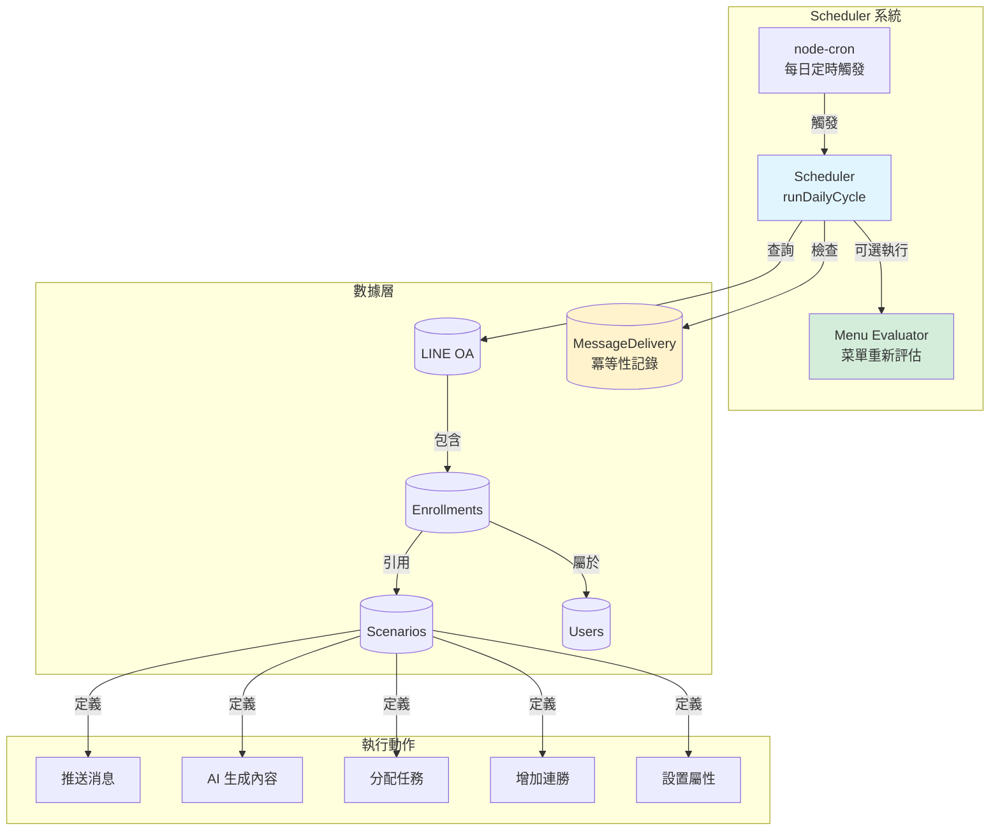
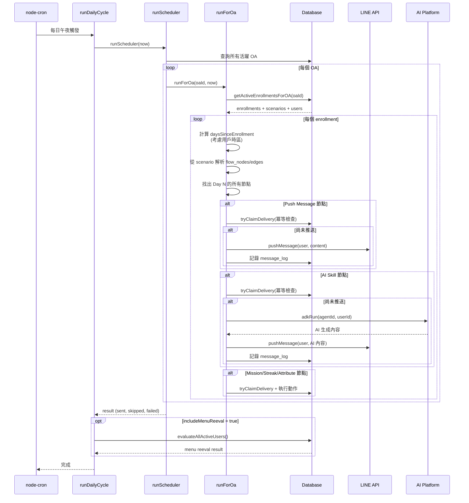
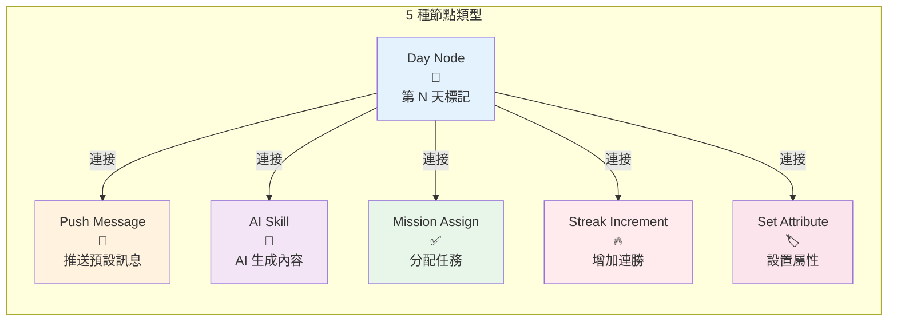
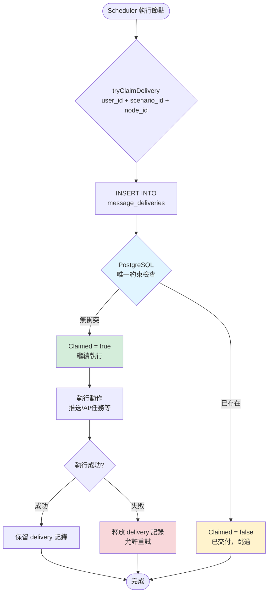
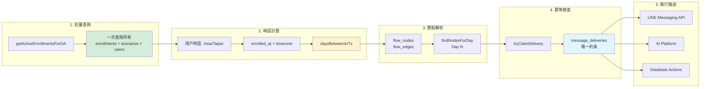

# Scheduler 系統完整指南

本文檔詳細說明 Vitera Scheduler 的工作原理、架構設計和使用方式。

Last updated: 2026-05-18

---

## 1. Scheduler 概述

Scheduler 是一個自動化任務執行引擎，通過 node-cron 驅動，每日運行以執行：
- 推送預設消息給活躍用戶
- 執行 AI 生成的推送內容
- 分配任務、增加連續記錄、設置屬性
- 重新評估用戶菜單

### 系統架構圖



### 核心 API 端點

```
POST /api/scheduler/run          - 執行每日調度週期
GET  /api/scheduler/activity     - 獲取活動數據
POST /api/scheduler/dry-run      - 模擬執行（無副作用）
```

---

## 2. Scheduler 執行流程

### 2.1 入口函數: runDailyCycle()

```typescript
export async function runDailyCycle(
  opts: DailyCycleOptions = {}
): Promise<SchedulerRunResult> {
  // 1. 執行 Scheduler
  const result = await runScheduler(now);

  // 2. 可選：重新評估菜單
  if (opts.includeMenuReeval !== false) {
    result.menuReeval = await evaluateAllActiveUsers();
  }

  return result;
}
```

### 2.2 運行時決策: OA 決定

```typescript
// 單 OA 模式（env: LINE_OA_ID）或多 OA 模式
const envOa = parseInt(process.env.LINE_OA_ID || '0');
let oaIds: number[];

if (envOa > 0) {
  oaIds = [envOa];  // 單 OA
} else {
  oaIds = (await getAllLineOAs())
    .filter(o => o.is_active)
    .map(o => o.id);  // 多 OA
}

for (const oaId of oaIds) {
  await runForOa(oaId, now);
}
```

### 2.3 核心執行邏輯: runForOa()

```typescript
async function runForOa(oaId: number, now: Date): Promise<SchedulerRunResult> {
  // 1. 取出該 OA 所有 active enrollments（包括 scenario 的 flow 資料）
  const enrollments = await getActiveEnrollmentsForOA(oaId);

  // 2. 對每個 enrollment，計算 daysSinceEnrollment
  for (const enr of enrollments) {
    const userId = enr.user.id;
    const tz = enr.user.timezone || 'Asia/Taipei';
    const daysSinceEnrollment = daysBetweenInTz(enr.enrolled_at, now, tz);

    // 3. 從 enrollment.scenario 取出 flow_nodes 和 flow_edges
    const nodes: FlowNode[] = Array.isArray(enr.scenario.flow_nodes)
      ? (enr.scenario.flow_nodes as FlowNode[])
      : [];
    const edges: FlowEdge[] = Array.isArray(enr.scenario.flow_edges)
      ? (enr.scenario.flow_edges as FlowEdge[])
      : [];

    // 4. 查詢 Day N 的所有動作節點
    const pushNodes = findPushNodesForDay(nodes, edges, daysSinceEnrollment);
    const aiNodes = findAiSkillNodesForDay(nodes, edges, daysSinceEnrollment);
    const missionNodes = findMissionAssignNodesForDay(nodes, edges, daysSinceEnrollment);
    const streakNodes = findStreakIncrementNodesForDay(nodes, edges, daysSinceEnrollment);
    const attrNodes = findSetAttributeNodesForDay(nodes, edges, daysSinceEnrollment);

    // 5. 執行每個動作（with idempotency via messageDelivery claim）
    // ... 詳見下一節
  }
}
```

### 完整執行流程圖



---

## 3. 多種節點類型的執行

### 節點類型總覽



**執行邏輯**：

- Scheduler 根據 `daysSinceEnrollment` 找到對應的 Day Node
- 然後找出連接到該 Day Node 的所有動作節點
- 依序執行每個動作節點（推送、AI、任務、連勝、屬性）
- 每個動作都有冪等性保護（透過 `message_delivery` 表）

### 3.1 推送消息節點 (Push Message Nodes)

```typescript
const pushNodes = findPushNodesForDay(nodes, edges, daysSinceEnrollment);

for (const pushNode of pushNodes) {
  // 冪等性檢查
  const claimed = await tryClaimDelivery(userId, enr.scenario.id, pushNode.id);
  if (!claimed) { skipped++; continue; }

  // 依 contentKey 或 inline data 構建訊息
  const message = buildLineMessage(pushNode.data);

  // 推送 + 日誌
  await client.pushMessage(userId, message);
  logOutboundLineMessage(oaId, userId, message, 'scheduler_push', ...);

  sent++;
}
```

### 3.2 AI 生成節點 (AI Skill Nodes)

```typescript
const aiNodes = findAiSkillNodesForDay(nodes, edges, daysSinceEnrollment);

for (const aiNode of aiNodes) {
  // 冪等性檢查
  const claimed = await tryClaimDelivery(userId, enr.scenario.id, aiNode.id);
  if (!claimed) { skipped++; continue; }

  // 調用 AI Skill Platform
  const result = await adkRun(
    aiNode.data?.agentId || 'ai-expert',
    userId,
    { url: oa.ai_skill_platform_url, ... }
  );

  // 推送 AI 生成內容
  const text = result.result;
  const aiMessage: Message = { type: 'text', text };
  await client.pushMessage(userId, aiMessage);

  sent++;
}
```

### 3.3 任務分配節點 (Mission Assign Nodes)

```typescript
const missionNodes = findMissionAssignNodesForDay(nodes, edges, daysSinceEnrollment);

for (const mNode of missionNodes) {
  // 冪等性檢查
  const claimed = await tryClaimDelivery(userId, enr.scenario.id, mNode.id);
  if (!claimed) { skipped++; continue; }

  // 根據 missionKey 查詢模板
  const template = await getMissionTemplateByKey(oa.product_id, mNode.data?.missionKey);

  // 分配任務（Prisma 唯一約束確保冪等）
  await assignMission(userId, template.id);

  sent++;
}
```

### 3.4 連續記錄節點 (Streak Increment Nodes)

```typescript
const streakNodes = findStreakIncrementNodesForDay(nodes, edges, daysSinceEnrollment);

for (const sNode of streakNodes) {
  // 冪等性檢查
  const claimed = await tryClaimDelivery(userId, enr.scenario.id, sNode.id);
  if (!claimed) { skipped++; continue; }

  // incrementStreak 本身已同日冪等
  await incrementStreak(oa.product_id, userId, sNode.data?.streakKey);

  sent++;
}
```

### 3.5 屬性設置節點 (Set Attribute Nodes)

```typescript
const attrNodes = findSetAttributeNodesForDay(nodes, edges, daysSinceEnrollment);

for (const aNode of attrNodes) {
  // 冪等性檢查
  const claimed = await tryClaimDelivery(userId, enr.scenario.id, aNode.id);
  if (!claimed) { skipped++; continue; }

  // 設置屬性並觸發 Hook 鏈
  await setUserAttributeWithHooks(
    userId,
    aNode.data?.attributeKey,
    aNode.data?.value ?? null,
    0,  // depth
    oa.product_id
  );

  sent++;
}
```

---

## 4. 冪等性設計

### 4.1 MessageDelivery 表的角色

```prisma
model MessageDelivery {
  id           Int      @id @default(autoincrement())
  user_id      String   @db.VarChar(64)
  scenario_id  String   @db.VarChar(30)
  node_id      String   @db.VarChar(100)
  delivered_at DateTime @default(now())

  user User @relation(fields: [user_id], references: [id], onDelete: Cascade)

  @@unique([user_id, scenario_id, node_id])  // 複合唯一約束
}
```

### 4.2 冪等性流程圖



### 4.3 冪等性流程代碼

```typescript
const claimed = await tryClaimDelivery(userId, scenario.id, node.id);
if (!claimed) {
  skipped++;  // 已交付，跳過
  continue;
}

// 嘗試執行
try {
  await executeAction(userId, node);
} catch (err) {
  // 失敗時釋放
  await releaseDelivery(userId, scenario.id, node.id);
  throw err;
}
```

### 4.4 幕後原理

1. **插入嘗試**: 嘗試插入 (user_id, scenario_id, node_id) 的唯一約束記錄
2. **唯一約束**: PostgreSQL 確保最多一行
3. **失敗返回**: 約束衝突 → 返回 false
4. **重試安全**: 重複執行 Scheduler，自動跳過已交付的節點

**優點**：

- 即使 Scheduler 多次執行，每個節點最多只推送一次
- 失敗可以重試（透過 releaseDelivery）
- 無需額外的分布式鎖，依賴資料庫原生能力

---

## 5. Dry-Run 功能

無副作用的模擬執行，用於調試和驗證：

```typescript
export async function dryRunScheduler(opts: DryRunOptions) {
  // 模擬查詢用戶、加入、節點等
  // 返回詳細的動作列表和警告

  return {
    user_id: userId,
    as_of: now.toISOString(),
    actions: [
      {
        scenario_id, scenario_name,
        node_id, node_type, day,
        description: "推播 → content_key: ...",
        already_delivered: !!existing,
        warning?: "內容未啟用"
      },
      ...
    ],
    notes: ["用戶目前沒有任何活躍的劇本加入紀錄"]
  };
}
```

### 使用場景

```bash
# 模擬執行，查看會發生什麼
POST /api/scheduler/dry-run

# 實際執行
POST /api/scheduler/run
```

---

## 6. 菜單重新評估

Scheduler 可選性包含菜單重新評估：

```typescript
export async function runDailyCycle(
  opts: DailyCycleOptions = {}
): Promise<SchedulerRunResult> {
  const result = await runScheduler(now);

  if (opts.includeMenuReeval !== false) {
    // 評估所有活躍用戶
    result.menuReeval = await evaluateAllActiveUsers();
  }

  return result;
}
```

---

## 7. 性能最佳實踐

### 7.1 數據查詢與推送流程



### 7.2 時區計算

```typescript
// ❌ 錯誤：使用 UTC 時間
const day = Math.floor((now - enrolledAt) / (24 * 60 * 60 * 1000));

// ✅ 正確：使用用戶時區
const day = daysBetweenInTz(enrolledAt, now, user.timezone);
```

**為什麼重要**：

- 全球用戶可能在不同時區
- UTC 計算會導致「今天」的定義錯誤
- 例如：台北時間 2024-01-02 00:30，UTC 是 2024-01-01 16:30
- 使用 UTC 會誤判為 Day 1，實際應該是 Day 2

### 7.2 批量查詢

```typescript
// ❌ 錯誤：逐個查詢
for (const user of users) {
  const enrollment = await db().enrollment.findFirst({
    where: { user_id: user.id, ... }
  });
}

// ✅ 正確：一次性查詢所有
const enrollments = await getActiveEnrollmentsForOA(oaId);
```

### 7.3 索引策略

```prisma
@@index([oa_id, status])        // 快速查詢 OA 的活躍 enrollments
@@index([user_id, date])        // 消息日誌快速查詢
```

---

## 8. 故障排查

### 常見問題

| 問題 | 原因 | 解決方案 |
|------|------|--------|
| 推送沒有執行 | scenario 未激活 (`is_active=false`) | 在 HQ 激活場景 |
| 消息推送重複 | messageDelivery 表損壞 | 檢查複合唯一約束 |
| 時間不對 | 用戶時區錯誤 | 驗證 `users.timezone` |
| AI 節點失敗 | `ai_skill_platform_url` 錯誤 | 檢查 LINE OA 配置 |

### 調試技巧

```typescript
// 1. 使用 dry-run 檢查會執行什麼
POST /api/scheduler/dry-run

// 2. 檢查 message_log
SELECT * FROM message_log WHERE user_id = ? ORDER BY created_at DESC;

// 3. 檢查 messageDelivery
SELECT * FROM message_deliveries WHERE user_id = ? AND scenario_id = ?;

// 4. 檢查 enrollments
SELECT * FROM enrollments WHERE user_id = ? AND status = 'active';
```

---

## 9. 集成示例：女性療癒課程

### 9.1 場景設計

```
Day 1: 推送歡迎訊息 + 分配前測任務
Day 7: 推送 D7 階段反饋
Day 14: 推送 D14 階段反饋
Day 21: 推送 D21 階段反饋
Day 28: 推送完課訊息 + 切換菜單
```

### 9.2 完整時間線圖

```mermaid
gantt
    title 28 天女性療癒課程推播時間線
    dateFormat YYYY-MM-DD
    axisFormat Day %d

    section 用戶參加
    Enrollment           :milestone, m1, 2024-01-01, 0d

    section 推播節點
    Day 1: 歡迎訊息 + 前測  :crit, d1, 2024-01-01, 1d
    Day 7: 階段反饋 D7    :d7, 2024-01-07, 1d
    Day 14: 階段反饋 D14   :d14, 2024-01-14, 1d
    Day 21: 階段反饋 D21   :d21, 2024-01-21, 1d
    Day 28: 完課訊息 + 菜單 :crit, d28, 2024-01-28, 1d

    section 任務分配
    前測任務           :active, t1, 2024-01-01, 7d
    追蹤任務           :active, t2, 2024-01-07, 21d
    後測任務           :active, t3, 2024-01-28, 3d

    section 連勝追蹤
    連續打卡計數        :active, s1, 2024-01-01, 28d
```

### 9.3 每日推送流程

```
Day 1 (午夜執行 Scheduler)
  ├─ 查詢所有 daysSinceEnrollment = 1 的用戶
  ├─ 找場景 flow_nodes 中 day=1 的推送節點
  ├─ contentKey = 'wh_welcome_msg'
  ├─ 取 ContentItem（Flex JSON）
  ├─ 推送給用戶
  └─ 記錄 message_delivery（冪等）

Day 7 (午夜執行 Scheduler)
  ├─ 查詢所有 daysSinceEnrollment = 7 的用戶
  ├─ 找場景 flow_nodes 中 day=7 的推送節點
  ├─ contentKey = 'stage_feedback_d7'
  ├─ 推送「D7 階段反饋」Flex 卡
  └─ 記錄 message_delivery

... 類似地進行 Day 14、21、28 ...
```

### 9.4 Scenario Flow 結構示例

```typescript
// coblocks_scenarios 表的 flow_nodes 和 flow_edges
{
  "flow_nodes": [
    { "id": "day-1", "type": "day-node", "data": { "day": 1 } },
    { "id": "push-welcome", "type": "push-message", "data": { "contentKey": "wh_welcome_msg" } },
    { "id": "mission-pretest", "type": "mission-assign", "data": { "missionKey": "pretest_survey" } },

    { "id": "day-7", "type": "day-node", "data": { "day": 7 } },
    { "id": "push-d7", "type": "push-message", "data": { "contentKey": "stage_feedback_d7" } },

    { "id": "day-28", "type": "day-node", "data": { "day": 28 } },
    { "id": "push-complete", "type": "push-message", "data": { "contentKey": "course_complete" } },
    { "id": "attr-complete", "type": "set-attribute", "data": { "attributeKey": "course_status", "value": "completed" } }
  ],
  "flow_edges": [
    { "source": "day-1", "target": "push-welcome" },
    { "source": "day-1", "target": "mission-pretest" },
    { "source": "day-7", "target": "push-d7" },
    { "source": "day-28", "target": "push-complete" },
    { "source": "day-28", "target": "attr-complete" }
  ]
}
```

---

## 10. 關鍵檔案參考

| 檔案 | 用途 |
|------|------|
| **src/lib/scheduler.ts** | Scheduler 核心邏輯 |
| **src/lib/flow.ts** | Flow 圖操作：節點查詢 |
| **src/controllers/scheduler.controller.ts** | HTTP 層 |
| **src/routes/scheduler.routes.ts** | 路由定義 |
| **src/lib/db.ts** | DB 操作函數 |
| **src/lib/menuEvaluator.ts** | 菜單選擇邏輯 |

---

## 11. 外部依賴

| 庫 | 用途 |
|----|------|
| **node-cron** | Cron 表達式排程 |
| **@line/bot-sdk** | LINE Messaging API |
| **@google/generative-ai** | Gemini API (AI 節點) |
| **date-fns** | 日期運算 |

---

## 12. 擴展指南

### 添加新的節點類型

1. 在 `flow.ts` 中定義節點類型
2. 實現 `findXxxNodesForDay()` 函數
3. 在 `runForOa()` 中添加執行邏輯
4. 確保使用 `tryClaimDelivery()` 保證冪等性

### 添加新的推送時機

修改 `coblocks_scenarios` 的 `flow_nodes`，添加新的 `day-node` 和相關的推送節點。
