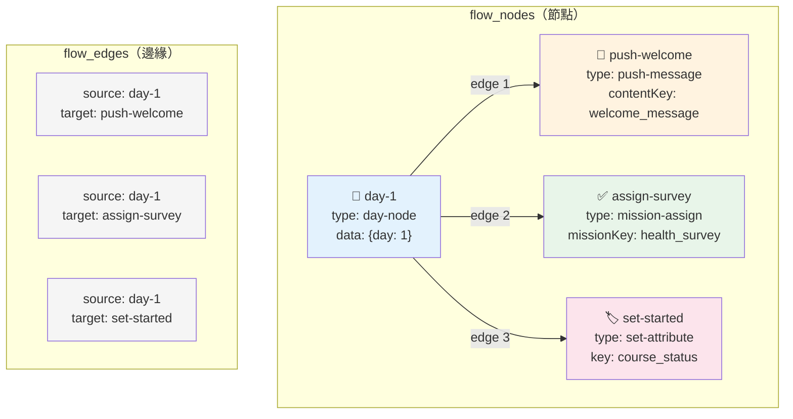
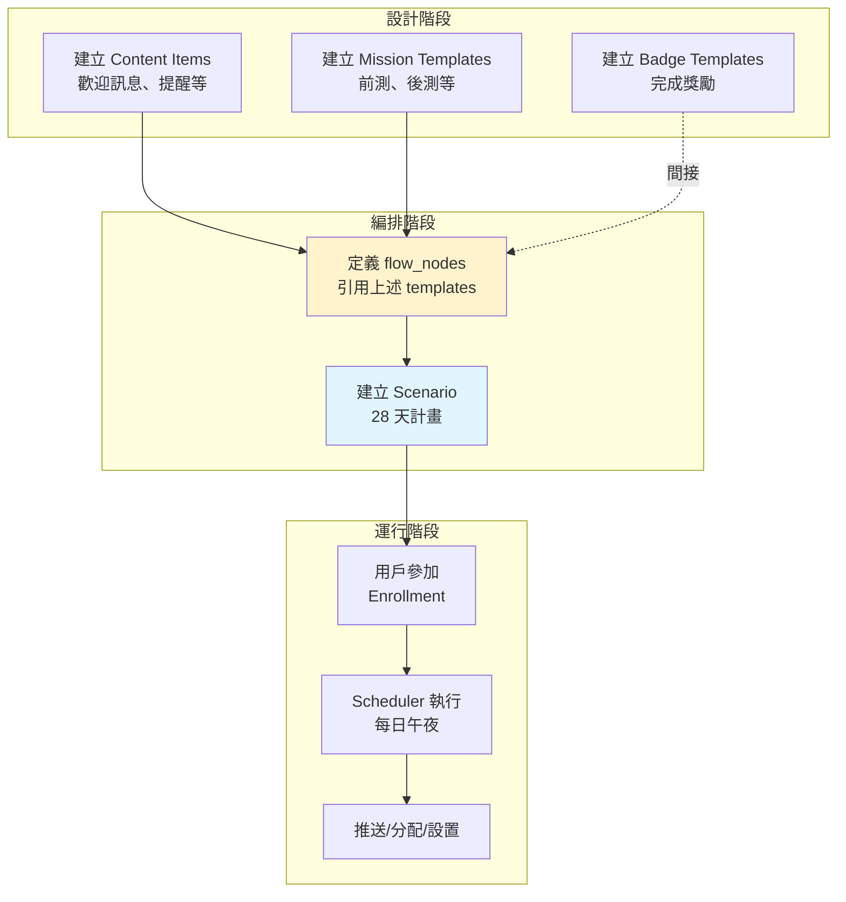

# Vitera 平台架構簡介

這是 Vitera 平台架構的核心概念說明。詳細的技術文檔請參考 [backend/docs/](../../backend/docs/) 目錄。

Last updated: 2026-05-18

---

## 📊 系統概述

Vitera 是一個**多產品、多租戶的健康管理平台**，主要包含以下幾個層次：

```
用戶層 (LINE OA)
    ↓
認證與追蹤層 (月經、補充品、傷口、足部健康)
    ↓
內容與規則層 (文案、任務、徽章、旅程)
    ↓
自動化與分析層 (Scheduler、Hook、事件追蹤)
```

### 主要特色

- 🔐 **LINE 登入整合**: 透過 LINE OA 提供服務
- 🏥 **健康追蹤**: 月經週期、補充品、傷口護理、足部健康
- 🎯 **可復用內容**: 文案、任務模板、徽章、旅程等可跨產品共享
- ⏰ **自動化推播**: 時間觸發的推播和菜單更新
- 📊 **完整記錄**: 消息日誌、事件追蹤、用戶互動歷史

---

## 🧠 核心概念

### 1. 多租戶架構

不同的 LINE 官方帳號可以共享相同的產品配置包：

```
LINE OA A (經期追蹤)  ┐
LINE OA B (術後照護)  ├─→ Product "女性健康" (共享任務、徽章、旅程)
LINE OA C (足部健康)  ┘
```

**詳細說明**: [HQ Backend 完整架構](../../backend/docs/hq-backend-architecture.md)

### 2. Hook 鏈機制

設置一個用戶屬性可以自動觸發一連串的動作：

```
設置屬性 "life_stage" = "新手"
  → 自動完成監聽該屬性的任務
    → 執行任務完成後的動作
      → 可能分配新任務
      → 可能增加連勝計數
      → 可能獲得徽章
      → 可能推進旅程階段
```

**為什麼需要 Hook 鏈？**
- ✅ 一次操作，自動連鎖反應
- ✅ 確保動作不會遺漏
- ✅ 減少 API 呼叫次數
- ✅ 保證原子性（要嘛全部成功，要嘛全部失敗）

**詳細說明**: [HQ Backend 完整架構](../../backend/docs/hq-backend-architecture.md)

### 3. Scheduler 系統

每天固定時間自動推播訊息給用戶：

```
午夜 00:00 (依照用戶時區)
  → 查找所有活躍的 Enrollments
  → 計算「今天是第幾天」
  → 推播對應天數的訊息
  → 更新 Rich Menu
```

**詳細說明**: [Scheduler 系統](../../backend/docs/scheduler-system.md)

### 4. Enrollments & Scenarios

用戶可以「參加」一個推播場景（例如：28 天經期追蹤計畫）：

```
用戶點擊「開始追蹤」
  → 創建 Enrollment (參加紀錄)
  → Scheduler 每天推播當天的訊息
  → 用戶可以隨時退出或完成
```

**詳細說明**: [Enrollments 場景指南](../../backend/docs/enrollments-scenarios-guide.md)

### 5. Scenarios 與 Templates 的關係

用**蓋房子**來比喻，最容易理解：

```
Templates (模板)          = 建材（磚頭、木板、水泥）
  ├─ Content Items        = 訊息文案（歡迎詞、提醒文字）
  ├─ Mission Templates    = 任務清單（每日打卡、問卷填寫）
  ├─ Badge Templates      = 獎章設計（連續 7 天、完成課程）
  └─ Journey Templates    = 階段規劃（新手 → 成長 → 熟練）

Scenarios (場景)          = 施工藍圖（定義何時用什麼建材）
  └─ flow_nodes + edges   = 時間表（第 1 天做什麼、第 7 天做什麼）

Scheduler (排程器)        = 建築工人（按照藍圖在正確時間施工）
  └─ 每天午夜自動執行     = 每天來工地檢查進度
```

**實際運作流程**：

1. **設計階段** - 先準備好所有建材（Templates）
   ```
   建立 Content Item: "歡迎訊息"
   建立 Mission: "每日打卡"
   建立 Badge: "連續 7 天達成"
   ```

2. **編排階段** - 畫出施工藍圖（Scenario）
   ```
   Scenario: "28 天經期追蹤計畫"
   - Day 1: 推播「歡迎訊息」+ 分配「每日打卡」任務
   - Day 7: 推播「階段反饋」
   - Day 28: 推播「完課訊息」+ 切換選單
   ```

3. **執行階段** - 工人按照藍圖施工（Scheduler）
   ```
   用戶參加 → 建立 Enrollment
   每天午夜 → Scheduler 檢查「今天是第幾天」
   自動推播 → 對應天數的訊息和任務
   ```

**為什麼要分開設計？**

✅ **可復用** - 一個「歡迎訊息」可以用在多個不同計畫
✅ **好維護** - 修改文案只需改 Content Item，不用改 Scenario
✅ **好擴展** - 新增一個 28 天計畫，只需重新編排，建材都現成的
✅ **職責分離** - Templates 負責「是什麼」，Scenarios 負責「何時用」

**簡單記憶法**：

- 📦 **Templates** = 可重複使用的配置包（跨產品共享）
- 📅 **Scenarios** = 時間序列的編排器（綁定特定 LINE OA）
- 🤖 **Scheduler** = 自動化執行引擎（每天午夜運行）

**詳細技術說明**: 參見本文檔的「[建立 coblocks_scenarios 的情境](#建立-coblocks_scenarios-的情境)」章節

### 6. 資料庫設計

核心表格分類：

- **用戶**: users, user_oa_sessions, user_attributes
- **健康追蹤**: periods, supplements, wounds, foot_health
- **內容**: content_items, mission_templates, badge_templates, journey_templates
- **互動**: mission_assignments, user_badges, user_journey_phases
- **推播**: coblocks_scenarios, enrollments
- **記錄**: message_log, engagement_events

**詳細說明**: [資料庫規範](../../backend/docs/db-conventions.md)

---

## 🏗️ 主要系統

### HQ Backend (後台管理系統)

運營人員可以透過 HQ 管理：
- 👥 用戶資料與屬性
- 📝 分配或撤銷任務
- 🏆 查看或撤銷徽章
- 📊 查看統計數據
- 👨‍💼 管理員帳號

**詳細說明**: [HQ Backend 完整架構](../../backend/docs/hq-backend-architecture.md)

### BaseController 模式

所有 Controller 都繼承自 BaseController，提供：
- 統一的錯誤處理
- 自動記錄 message_log 和 engagement_events
- 標準化的 HTTP 回應格式

**詳細說明**: [BaseController 使用方式](../../backend/docs/base-controller-usage.md)

### 問卷系統

支援多種題型的問卷：
- 單選、多選
- 量表（1-5 分）
- 文字輸入
- 日期選擇

**詳細說明**: [問卷範例](../../backend/docs/questionnaire-examples.md)

---

## 📚 重要名詞

在閱讀文檔和程式碼時，你會經常遇到以下名詞：

### 核心業務概念

**Intent Rules (意圖規則)**
- 用來匹配用戶輸入（文字訊息）並執行對應動作的規則
- 例如：用戶輸入「開始追蹤」→ 觸發特定的回覆或動作
- 資料表：`intent_rules`

**Enrollments (參加紀錄)**
- 用戶「參加」某個推播場景的記錄
- 記錄開始時間、當前狀態（active/completed/cancelled）
- 資料表：`enrollments`
- 詳細說明：[Enrollments 場景指南](../../backend/docs/enrollments-scenarios-guide.md)

**Scenarios (推播場景)**
- 定義一系列按天數推播的訊息流程
- 例如：「28 天經期追蹤計畫」在第 1、7、14、28 天各推播不同訊息
- 資料表：`coblocks_scenarios`
- 詳細說明：[Enrollments 場景指南](../../backend/docs/enrollments-scenarios-guide.md)

**Rich Menu**
- LINE 官方帳號底部的選單
- 可根據用戶狀態動態切換不同選單
- 由 `rich_menus` 和 `menu_conditions` 表管理

### 任務與遊戲化

**Mission Templates (任務模板)**
- 定義任務的模板（名稱、類型、完成條件、完成後動作等）
- 任務類型：one_shot（一次性）、binary_daily（每日打卡）、quantitative_daily（每日量化）
- 資料表：`mission_templates`

**Mission Assignments (任務分配)**
- 用戶被分配的任務實例
- 記錄狀態（pending/completed/failed）、進度、完成時間
- 資料表：`mission_assignments`

**Badge Templates (徽章模板)**
- 定義徽章的模板（名稱、圖標、獲得條件）
- 條件類型：streak_reached（連勝達成）、mission_completed（任務完成）
- 資料表：`badge_templates`

**Journey Templates (旅程模板)**
- 定義用戶在產品生命週期中的階段（例如：新手 → 成長 → 熟練）
- 定義階段轉換的條件
- 資料表：`journey_templates`

**User Streaks (連勝計數)**
- 記錄用戶連續完成某項任務的天數
- 例如：連續打卡 7 天
- 資料表：`user_streaks`

### 用戶與內容

**User Attributes (用戶屬性)**
- 用戶的動態屬性，以鍵值對形式存儲
- 例如：`{ "life_stage": "新手", "onboarding_completed": "true" }`
- 設置屬性時會觸發 Hook 鏈
- 資料表：`user_attributes`

**Content Items (內容項目)**
- 可復用的訊息內容（文字、圖片、按鈕等）
- 可以被多個地方引用（Intent Rules、Scenarios、任務完成後等）
- 資料表：`content_items`

**Products (產品配置包)**
- 包含一組可復用的配置（任務、徽章、旅程、規則等）
- 可以被多個 LINE OA 共享
- 資料表：`products`

**User OA Session**
- 用戶與某個 LINE 官方帳號的綁定關係
- 記錄 LINE User ID、當前使用的 Product 等
- 資料表：`user_oa_sessions`

### 記錄與追蹤

**Message Log (消息日誌)**
- 記錄所有進出的訊息（用戶傳送的、系統回覆的、推播的）
- 用於審計、除錯、分析
- 資料表：`message_log`

**Engagement Events (互動事件)**
- 記錄用戶的重要行為事件
- 例如：intent_matched（規則匹配）、badge_earned（獲得徽章）、mission_completed（任務完成）
- 資料表：`engagement_events`

---

## 📝 建立 Templates

Templates 是 Vitera 系統中可復用的配置模板。以下說明如何建立、規則、以及查詢位置。

### Mission Templates (任務模板)

**如何建立**
- ✅ 透過 API：`POST /api/products/:productId/missions`
- 也可以透過資料庫直接插入到 `mission_templates` 表
- HQ Products 管理介面建立

**核心欄位**
```typescript
{
  product_id: number,              // 所屬產品 ID
  key: string,                     // 唯一識別碼，例如："daily_exercise"
  name: string,                    // 任務顯示名稱，例如："每日運動"
  mission_type: "one_shot" | "binary_daily" | "quantitative_daily" | "checklist_daily",
  progress_target: number | null,  // 目標進度（量化任務使用，例如：3 代表要完成 3 次）
  on_complete_actions: {           // 任務完成後自動執行的動作（可觸發 Hook 鏈）
    set_attribute?: { key: string, value: string },      // 設置用戶屬性
    assign_mission?: { mission_key: string },            // 自動分配下一個任務
    increment_streak?: { streak_key: string }            // 增加連勝計數
  }[],
  auto_complete_on_attribute?: {   // 當用戶屬性符合條件時，自動完成任務
    key: string,                   // 監聽的屬性 key，例如："onboarding_status"
    value: string                  // 當屬性值等於此值時完成，例如："completed"
  }
}
```

**欄位說明：**

- **mission_type**: 任務類型
  - `one_shot`: 一次性任務（例如：完成新手教程）
  - `binary_daily`: 每日打卡型（例如：每日喝水打卡）
  - `quantitative_daily`: 每日量化型（例如：每日運動 3 次）
  - `checklist_daily`: 每日清單型（有多個子項目）

- **on_complete_actions**: 完成後觸發的連鎖動作
  - 可以設置多個動作，按順序執行
  - 會觸發 Hook 鏈機制

- **auto_complete_on_attribute**: 屬性監聽機制
  - 當用戶屬性改變時，系統會檢查所有任務的這個欄位
  - 如果屬性值符合，自動完成任務

**API 端點**
- `GET /api/products/:productId/missions` - 獲取所有任務模板
- `POST /api/products/:productId/missions` - 創建任務模板
- `PATCH /api/products/:productId/missions/:missionId` - 更新任務模板
- `DELETE /api/products/:productId/missions/:missionId` - 刪除任務模板

**查詢位置**
- Schema 定義：[Vitera/backend/prisma/schema.prisma](../../backend/prisma/schema.prisma)
- API Routes：[Vitera/backend/src/routes/products.routes.ts](../../backend/src/routes/products.routes.ts)
- 詳細說明：[HQ Backend 架構](../../backend/docs/hq-backend-architecture.md)

### Badge Templates (徽章模板)

**如何建立**
- ✅ 透過 API：`POST /api/products/:productId/badges`
- 也可以透過資料庫直接插入到 `badge_templates` 表
- HQ Products 管理介面建立

**核心欄位**
```typescript
{
  product_id: number,              // 所屬產品 ID
  key: string,                     // 唯一識別碼，例如："streak_7_days"
  name: string,                    // 徽章顯示名稱，例如："連續 7 天達成"
  description: string | null,      // 徽章描述文字，例如："恭喜你連續打卡 7 天！"
  icon_emoji: string | null,       // emoji 圖標，例如："🏆"（二選一）
  icon_url: string | null,         // 圖片 URL（與 emoji 二選一）
  criteria: {                      // 自動獲得徽章的條件
    type: "streak_reached" | "mission_completed",
    streak_key?: string,           // 連勝計數的 key，例如："daily_checkin"
    threshold?: number,            // 達到多少天，例如：7
    mission_key?: string           // 完成哪個任務，例如："onboarding"
  },
  notify_content_key: string | null // 獲得徽章時推播的訊息 content_key
}
```

**欄位說明：**

- **icon_emoji vs icon_url**: 擇一使用
  - 使用 emoji 比較簡單，例如 "🏆"、"🎖️"、"⭐"
  - 使用圖片 URL 可以自訂設計

- **criteria**: 徽章自動發放條件
  - `streak_reached`: 連勝達成（例如：連續打卡 7 天）
  - `mission_completed`: 任務完成（例如：完成新手教程）

- **notify_content_key**: 獲得徽章時的推播訊息
  - 引用 `content_items` 表中的 key
  - 如果為 null，則不推播

**API 端點**
- `GET /api/products/:productId/badges` - 獲取所有徽章模板
- `POST /api/products/:productId/badges` - 創建徽章模板
- `PATCH /api/products/:productId/badges/:badgeId` - 更新徽章模板
- `DELETE /api/products/:productId/badges/:badgeId` - 刪除徽章模板

**查詢位置**
- Schema 定義：[Vitera/backend/prisma/schema.prisma](../../backend/prisma/schema.prisma)
- API Routes：[Vitera/backend/src/routes/products.routes.ts](../../backend/src/routes/products.routes.ts)
- 詳細說明：[HQ Backend 架構](../../backend/docs/hq-backend-architecture.md)

### Journey Templates (旅程模板)

**如何建立**
- ✅ 透過 API：`POST /api/products/:productId/journeys`
- 也可以透過資料庫直接插入到 `journey_templates` 表
- HQ Products 管理介面建立

**核心欄位**
```typescript
{
  product_id: number,              // 所屬產品 ID
  journey_key: string,             // 旅程唯一識別碼，例如："onboarding"
  name: string,                    // 旅程顯示名稱，例如："新手引導旅程"
  phases: {                        // 階段定義（所有可能的階段）
    [phase_key: string]: {         // 階段 key，例如："beginner"
      name: string,                // 階段名稱，例如："新手階段"
      description?: string         // 階段描述（選填）
    }
  },
  transitions: {                   // 階段轉換規則（定義如何從一個階段進入下一個）
    from: string,                  // 起始階段 key，例如："beginner"
    to: string,                    // 目標階段 key，例如："intermediate"
    condition: {                   // 轉換觸發條件
      type: "attribute_equals",    // 條件類型（目前只支援屬性等於）
      key: string,                 // 屬性 key，例如："lesson_completed"
      value: string                // 屬性值，例如："5"
    }
  }[]
}
```

**欄位說明：**

- **phases**: 定義旅程中所有可能的階段
  - 例如：新手 → 成長 → 熟練 → 專家
  - 每個用戶在某個時間點只會處於一個階段

- **transitions**: 階段轉換規則
  - 定義如何從一個階段移動到另一個階段
  - 當用戶的屬性改變時，系統會檢查是否符合轉換條件
  - 如果符合，自動將用戶移到下一個階段

**使用範例：**
```typescript
{
  journey_key: "onboarding",
  phases: {
    "new_user": { name: "新手" },
    "active_user": { name: "活躍用戶" },
    "power_user": { name: "進階用戶" }
  },
  transitions: [
    {
      from: "new_user",
      to: "active_user",
      condition: { type: "attribute_equals", key: "days_active", value: "7" }
    },
    {
      from: "active_user",
      to: "power_user",
      condition: { type: "attribute_equals", key: "missions_completed", value: "20" }
    }
  ]
}
```

**API 端點**
- `GET /api/products/:productId/journeys` - 獲取所有旅程模板
- `POST /api/products/:productId/journeys` - 創建旅程模板
- `PATCH /api/products/:productId/journeys/:journeyId` - 更新旅程模板
- `DELETE /api/products/:productId/journeys/:journeyId` - 刪除旅程模板

**查詢位置**
- Schema 定義：[Vitera/backend/prisma/schema.prisma](../../backend/prisma/schema.prisma)
- API Routes：[Vitera/backend/src/routes/products.routes.ts](../../backend/src/routes/products.routes.ts)
- 詳細說明：[HQ Backend 架構](../../backend/docs/hq-backend-architecture.md)

### Content Items (內容模板)

**如何建立**
- ✅ 透過 API：`POST /api/products/:productId/content`
- 也可以透過資料庫直接插入到 `content_items` 表
- HQ Products 管理介面建立

**核心欄位**
```typescript
{
  product_id: number,              // 所屬產品 ID
  key: string,                     // 唯一識別碼，例如："welcome_message"
  content: {                       // LINE 訊息內容
    type: "text" | "flex" | "image",
    text?: string,                 // 純文字內容（type="text" 時使用）
    altText?: string,              // Flex Message 的替代文字（推播通知顯示）
    contents?: object              // Flex Message 的 JSON（type="flex" 時使用）
  }
}
```

**欄位說明：**

- **type**: 訊息類型
  - `text`: 純文字訊息（最簡單）
  - `flex`: LINE Flex Message（可以做卡片、按鈕等豐富互動）
  - `image`: 圖片訊息

- **altText**: Flex Message 的替代文字
  - 顯示在 LINE 推播通知上
  - 因為推播通知無法顯示 Flex Message，所以需要替代文字
  - 例如："您有新的任務通知"

- **contents**: Flex Message JSON
  - 使用 [LINE Flex Message Simulator](https://developers.line.biz/flex-simulator/) 設計
  - 可以包含圖片、按鈕、連結等互動元素

**使用範例：**
```typescript
// 純文字
{
  key: "welcome",
  content: {
    type: "text",
    text: "歡迎加入！"
  }
}

// Flex Message
{
  key: "task_card",
  content: {
    type: "flex",
    altText: "您有新任務",
    contents: { /* Flex Message JSON */ }
  }
}
```

**API 端點**
- `GET /api/products/:productId/content` - 獲取所有內容項目
- `POST /api/products/:productId/content` - 創建內容項目
- `PATCH /api/products/:productId/content/:contentId` - 更新內容項目
- `DELETE /api/products/:productId/content/:contentId` - 刪除內容項目

**查詢位置**
- Schema 定義：[Vitera/backend/prisma/schema.prisma](../../backend/prisma/schema.prisma)
- API Routes：[Vitera/backend/src/routes/products.routes.ts](../../backend/src/routes/products.routes.ts)
- LINE Flex Message 格式：[LINE Flex Message Simulator](https://developers.line.biz/flex-simulator/)

### Intent Rules (意圖規則)

**如何建立**
- ✅ 透過 API：`POST /api/products/:productId/intent-rules`
- 也可以透過資料庫直接插入到 `intent_rules` 表
- HQ Products 管理介面建立

**核心欄位**
```typescript
{
  product_id: number,              // 所屬產品 ID
  priority: number,                // 優先順序（數字越小越優先，例如：1 比 10 優先）
  is_active: boolean,              // 是否啟用此規則
  match_type: "exact" | "contains" | "regex",  // 匹配方式
  pattern: string,                 // 匹配模式（根據 match_type 而定）
  actions: {                       // 匹配成功後執行的動作（可多個）
    type: "reply" | "set_attribute" | "assign_mission" | "enroll_scenario",
    content_key?: string,          // 回覆訊息的 content_key
    attribute_key?: string,        // 設置哪個屬性
    attribute_value?: string,      // 設置成什麼值
    mission_key?: string,          // 分配哪個任務
    scenario_key?: string          // 參加哪個推播場景
  }[]
}
```

**欄位說明：**

- **match_type**: 文字匹配方式
  - `exact`: 完全相符（例如：用戶輸入必須是「開始」）
  - `contains`: 包含關鍵字（例如：用戶輸入「我要開始追蹤」會匹配「開始」）
  - `regex`: 正則表達式（例如：`^開始.*追蹤$`）

- **priority**: 優先順序
  - 當多個規則都匹配時，執行優先順序最高的（數字最小的）
  - 建議：通用規則設高數字，特定規則設低數字

- **actions**: 動作列表
  - 可以設置多個動作，按順序執行
  - `reply`: 回覆訊息
  - `set_attribute`: 設置用戶屬性（會觸發 Hook 鏈）
  - `assign_mission`: 分配任務
  - `enroll_scenario`: 讓用戶參加推播場景

**使用範例：**
```typescript
{
  priority: 10,
  is_active: true,
  match_type: "contains",
  pattern: "開始追蹤",
  actions: [
    {
      type: "reply",
      content_key: "start_tracking_message"
    },
    {
      type: "enroll_scenario",
      scenario_key: "period_tracking_28days"
    }
  ]
}
```

**API 端點**
- `GET /api/products/:productId/intent-rules` - 獲取所有意圖規則
- `POST /api/products/:productId/intent-rules` - 創建意圖規則
- `PATCH /api/products/:productId/intent-rules/:ruleId` - 更新意圖規則
- `DELETE /api/products/:productId/intent-rules/:ruleId` - 刪除意圖規則

**查詢位置**
- Schema 定義：[Vitera/backend/prisma/schema.prisma](../../backend/prisma/schema.prisma)
- API Routes：[Vitera/backend/src/routes/products.routes.ts](../../backend/src/routes/products.routes.ts)
- 詳細說明：[HQ Backend 架構](../../backend/docs/hq-backend-architecture.md)

### Questionnaires (問卷模板)

**如何建立**
- ✅ 透過 API：`POST /api/questionnaires/:productId`
- 也可以透過資料庫直接插入到 `questionnaires` 表
- HQ Products 管理介面建立

**核心欄位**
```typescript
{
  product_id: number,              // 所屬產品 ID
  key: string,                     // 唯一識別碼，例如："health_survey"
  title: string,                   // 問卷標題，例如："健康狀況調查"
  questions: {                     // 問題列表（按順序顯示）
    id: string,                    // 問題 ID，例如："q1"
    type: "single_choice" | "multiple_choice" | "text" | "number" | "date" | "scale",
    question: string,              // 問題文字，例如："您的運動頻率？"
    options?: string[],            // 選項列表（選擇題使用）
    min?: number,                  // 最小值（量表或數字題使用）
    max?: number,                  // 最大值（量表或數字題使用）
    required?: boolean             // 是否為必填（預設 false）
  }[]
}
```

**欄位說明：**

- **type**: 問題類型
  - `single_choice`: 單選題（例如：性別）
  - `multiple_choice`: 多選題（例如：興趣選項）
  - `text`: 文字輸入（例如：姓名）
  - `number`: 數字輸入（例如：年齡）
  - `date`: 日期選擇（例如：生日）
  - `scale`: 量表（例如：1-5 分滿意度）

- **options**: 選項列表
  - 只在 `single_choice` 或 `multiple_choice` 時需要
  - 例如：`["每天", "每週 3-5 次", "偶爾", "從不"]`

- **min / max**: 數值範圍
  - `scale` 類型：例如 min=1, max=5 代表 1-5 分量表
  - `number` 類型：限制輸入的數字範圍

**使用範例：**
```typescript
{
  key: "health_survey",
  title: "健康狀況調查",
  questions: [
    {
      id: "q1",
      type: "single_choice",
      question: "您的運動頻率？",
      options: ["每天", "每週 3-5 次", "偶爾", "從不"],
      required: true
    },
    {
      id: "q2",
      type: "scale",
      question: "您的睡眠品質如何？",
      min: 1,
      max: 5,
      required: true
    }
  ]
}
```

**API 端點**
- `GET /api/questionnaires/:productId` - 獲取所有問卷
- `POST /api/questionnaires/:productId` - 創建問卷
- `PATCH /api/questionnaires/:productId/:key` - 更新問卷
- `DELETE /api/questionnaires/:productId/:key` - 刪除問卷

**查詢位置**
- Schema 定義：[Vitera/backend/prisma/schema.prisma](../../backend/prisma/schema.prisma)
- API Routes：[Vitera/backend/src/routes/questionnaire.routes.ts](../../backend/src/routes/questionnaire.routes.ts)
- 詳細範例：[問卷範例](../../backend/docs/questionnaire-examples.md)

### Coblocks Scenarios (推播場景)

**如何建立**
- ✅ 透過 API：`POST /api/wizard/oa/:oaId/scenarios`
- 也可以透過資料庫直接插入到 `coblocks_scenarios` 表
- HQ Line QA 管理介面建立

**核心欄位**
```typescript
{
  line_oa_id: number,              // 所屬 LINE OA ID
  key: string,                     // 唯一識別碼，例如："period_28days"
  name: string,                    // 場景顯示名稱，例如："28 天經期追蹤"
  blocks: {                        // 推播時程（定義第幾天推播什麼）
    day: number,                   // 第幾天推播（從 0 或 1 開始，視實作而定）
    content_key: string            // 推播的訊息內容 key（引用 content_items）
  }[]
}
```

**欄位說明：**

- **line_oa_id**: 所屬的 LINE 官方帳號
  - 不同於其他 templates 使用 `product_id`
  - Scenarios 是綁定特定 LINE OA 的

- **blocks**: 推播時程表
  - 定義在第幾天推播什麼訊息
  - 每天午夜 Scheduler 會檢查並推播對應天數的訊息
  - `content_key` 必須是已存在的 `content_items` 的 key

- **運作方式**:
  1. 用戶「參加」場景（建立 `enrollment` 記錄）
  2. Scheduler 每天計算「今天是第幾天」
  3. 推播對應天數的訊息
  4. 用戶可以隨時退出或完成場景

**使用範例：**
```typescript
{
  line_oa_id: 1,
  key: "period_28days",
  name: "28 天經期追蹤",
  blocks: [
    { day: 1, content_key: "day1_welcome" },
    { day: 7, content_key: "day7_checkin" },
    { day: 14, content_key: "day14_midpoint" },
    { day: 28, content_key: "day28_complete" }
  ]
}
```

**相關概念：**
- **Enrollment**: 用戶參加場景的記錄
- **Scheduler**: 每天自動推播的系統
- 詳見：[Enrollments 場景指南](../../backend/docs/enrollments-scenarios-guide.md)

**API 端點**
- `GET /api/wizard/oa/:oaId/scenarios` - 獲取 OA 的所有場景
- `POST /api/wizard/oa/:oaId/scenarios` - 創建場景
- `PATCH /api/wizard/scenarios/:id` - 更新場景
- `DELETE /api/wizard/scenarios/:id` - 刪除場景
- `POST /api/wizard/scenarios/:id/enroll-all` - 批量註冊所有用戶

**查詢位置**
- Schema 定義：[Vitera/backend/prisma/schema.prisma](../../backend/prisma/schema.prisma)
- API Routes：[Vitera/backend/src/routes/wizard.routes.ts](../../backend/src/routes/wizard.routes.ts)
- 詳細說明：[Enrollments 場景指南](../../backend/docs/enrollments-scenarios-guide.md)

---

#### 建立 coblocks_scenarios 的情境

**使用場景**

當你需要建立一個**時間序列的自動化推播流程**時，就會建立一個 `coblocks_scenarios` row。例如：

- **28 天經期追蹤計畫** - 在第 1、7、14、28 天推播不同內容
- **新手引導流程** - Day 1 歡迎、Day 3 提醒、Day 7 完成獎勵
- **課程學習計畫** - 每天推送一個新課程單元
- **習慣養成計畫** - 21 天養成習慣，每天推送鼓勵訊息

**建立方式**

```typescript
// 透過 API 建立
POST /api/wizard/oa/:oaId/scenarios

// 或直接插入資料庫
INSERT INTO coblocks_scenarios (oa_id, name, flow_nodes, flow_edges, is_active)
VALUES (1, '28天經期追蹤', '[...]', '[...]', true);
```

#### 與 Templates 的關係

**關係圖：**

```
coblocks_scenarios (場景編排器)
    ↓
flow_nodes (節點定義)
    ↓ (引用/參照)
    ├─ content_items         (透過 contentKey)
    ├─ mission_templates     (透過 missionKey)
    ├─ badge_templates       (間接，透過 mission 完成觸發)
    ├─ journey_templates     (間接，透過 attribute 變更觸發)
    └─ user_attributes       (透過 set-attribute 節點)
```

**flow_nodes & flow_edges 是什麼？**

CoBlocks Scenarios 使用「圖結構」來定義推播流程，包含兩個核心元素：

**flow_nodes（節點）**
- 代表流程中的每個「動作」或「時間點」
- 每個節點有：
  - `id`: 唯一識別碼（例如：`"day-1"`、`"push-welcome"`）
  - `type`: 節點類型（例如：`day-node`、`push-message`、`mission-assign`）
  - `data`: 節點資料（例如：第幾天、要推播什麼內容）

**flow_edges（邊緣）**
- 定義節點之間的「連接關係」和「執行順序」
- 每條邊有：
  - `source`: 起點節點 ID
  - `target`: 終點節點 ID
- 表示「當 source 節點觸發時，執行 target 節點」

**為什麼用圖結構？**

1. **支援分支邏輯**：一個 Day Node 可以連接到多個動作（同時推送訊息 + 分配任務）
2. **支援條件跳轉**：未來可以根據用戶狀態決定走哪條路徑
3. **視覺化編排**：可以用拖拉方式設計流程（類似流程圖）
4. **靈活擴展**：新增節點類型不需要改變資料結構

**視覺化示意圖**



**執行流程說明：**

1. Scheduler 計算用戶參加場景後已經過了幾天
2. 找到對應天數的 Day Node（例如：`day-1`）
3. 查找 `flow_edges` 中所有 `source` 為 `day-1` 的邊
4. 依序執行所有 `target` 節點（`push-welcome`、`assign-survey`、`set-started`）
5. 每個節點執行前都會進行冪等性檢查（避免重複執行）

**具體範例**

```typescript
// coblocks_scenarios 的 flow_nodes
{
  "flow_nodes": [
    // Day 1 節點
    {
      "id": "day-1",
      "type": "day-node",
      "data": { "day": 1 }
    },

    // 推送訊息節點 → 引用 content_items
    {
      "id": "push-welcome",
      "type": "push-message",
      "data": {
        "contentKey": "welcome_message"  // ← 引用 content_items.key
      }
    },

    // 分配任務節點 → 引用 mission_templates
    {
      "id": "assign-survey",
      "type": "mission-assign",
      "data": {
        "missionKey": "health_survey"  // ← 引用 mission_templates.key
      }
    },

    // 設置屬性節點 → 會觸發 Hook 鏈
    {
      "id": "set-started",
      "type": "set-attribute",
      "data": {
        "attributeKey": "course_status",
        "value": "started"  // ← 可能觸發 journey 轉換或 badge 獲得
      }
    }
  ],
  "flow_edges": [
    { "source": "day-1", "target": "push-welcome" },
    { "source": "day-1", "target": "assign-survey" },
    { "source": "day-1", "target": "set-started" }
  ]
}
```

#### 核心區別

| 特性 | coblocks_scenarios | xxx_templates |
|------|-------------------|---------------|
| **用途** | 編排時間流程 | 定義可復用單元 |
| **層級** | 頂層編排器 | 底層配置單元 |
| **觸發** | Scheduler 定時觸發 | 被 scenario 或 webhook 引用 |
| **綁定** | 綁定 LINE OA | 綁定 Product（可跨 OA 共享） |
| **內容** | flow_nodes + flow_edges | 具體配置（文字、規則、條件等） |

#### 完整數據流



#### 為什麼要這樣設計？

**1. 可復用性**
- `content_items`、`mission_templates` 等可以被多個 scenarios 共享
- 例如："歡迎訊息" 可以用在多個不同的課程計畫中

**2. 靈活性**
- Scenario 只是「編排」，不包含實際內容
- 修改內容只需改 `content_items`，不用改 scenario

**3. 解耦**
- Scenarios 綁定 LINE OA（推播流程）
- Templates 綁定 Product（業務邏輯）
- 兩者獨立管理

#### 實際例子

假設你要建立「28 天經期追蹤計畫」：

**步驟 1：準備 Templates**

```sql
-- 建立內容項目
INSERT INTO content_items (product_id, key, content)
VALUES (1, 'day1_welcome', '{"type":"text","text":"歡迎加入 28 天計畫！"}');

-- 建立任務模板
INSERT INTO mission_templates (product_id, key, name, mission_type)
VALUES (1, 'daily_record', '每日記錄', 'binary_daily');
```

**步驟 2：建立 Scenario（編排流程）**

```sql
INSERT INTO coblocks_scenarios (oa_id, name, flow_nodes, flow_edges)
VALUES (1, '28天經期追蹤',
  '[
    {"id":"day-1","type":"day-node","data":{"day":1}},
    {"id":"push-1","type":"push-message","data":{"contentKey":"day1_welcome"}},
    {"id":"mission-1","type":"mission-assign","data":{"missionKey":"daily_record"}}
  ]',
  '[
    {"source":"day-1","target":"push-1"},
    {"source":"day-1","target":"mission-1"}
  ]'
);
```

**步驟 3：用戶參加**

```sql
-- 用戶參加場景
INSERT INTO enrollments (user_id, scenario_id, status)
VALUES ('U123456', 'scenario_cuid', 'active');
```

**步驟 4：Scheduler 自動執行**

- **Day 1 午夜**：推送 `day1_welcome` 訊息 + 分配 `daily_record` 任務
- **Day 2 午夜**：繼續執行 Day 2 的節點...

#### 簡單來說：

- **Templates** = 積木（可復用的配置單元）
- **Scenario** = 藍圖（定義如何、何時使用這些積木）
- **Scheduler** = 建築工人（按照藍圖在正確的時間執行）

**詳細 Scheduler 機制**：參見 [Scheduler System 文檔](../../backend/docs/scheduler-system.md)

---

### 建立 Templates 的最佳實踐

1. **使用有意義的 key**: key 應該清楚描述用途，例如 `onboarding_complete`、`daily_exercise`
2. **關聯到正確的 Product**: 確保 `product_id` 正確，這樣才能跨 OA 共享
3. **測試 Hook 鏈**: 建立 Mission Template 時，注意 `on_complete_actions` 可能觸發的連鎖反應
4. **版本控制**: 重要的 Templates 可以考慮用 migration 或 seed 檔案管理
5. **參考現有範例**: 查看資料庫中現有的 templates 作為參考

**查詢現有 Templates**
```sql
-- 查看所有任務模板
SELECT * FROM mission_templates WHERE product_id = 1;

-- 查看所有徽章模板
SELECT * FROM badge_templates WHERE product_id = 1;

-- 查看所有意圖規則（按優先順序）
SELECT * FROM intent_rules WHERE product_id = 1 ORDER BY priority ASC;
```

---

## 🔄 關鍵工作流

### 1. 用戶首次使用

```
用戶加入 LINE OA
  → Webhook 收到 follow 事件
  → 創建 users 和 user_oa_sessions
  → 推播歡迎訊息
  → 顯示 Rich Menu
```

### 2. 用戶傳送訊息

```
用戶傳送文字
  → Webhook 收到 message 事件
  → Intent Rules 匹配關鍵字
  → 執行對應動作（回覆訊息、設置屬性、分配任務...）
  → 記錄到 message_log
```

### 3. 每日自動推播

```
午夜 00:00 (用戶時區)
  → Scheduler 查找活躍 Enrollments
  → 推播當天訊息
  → 更新 Rich Menu
  → 記錄推播結果
```

---

## 🔌 重要整合

### LINE Messaging API
- 推播訊息
- Rich Menu 管理
- Webhook 事件接收

### LIFF (LINE Frontend Framework)
- 前端頁面（月經追蹤、補充品記錄等）
- 使用 LINE 登入

### OpenAI / Claude API
- AI Agent 對話
- 意圖分類
- 智能回覆

---

## 📖 更多文檔

完整的技術文檔請參考：

- [HQ Backend 完整架構](../../backend/docs/hq-backend-architecture.md) - HQ 系統的詳細說明
- [Scheduler 系統](../../backend/docs/scheduler-system.md) - 自動推播的運作原理
- [Enrollments 場景指南](../../backend/docs/enrollments-scenarios-guide.md) - 推播場景的設計與使用
- [BaseController 使用方式](../../backend/docs/base-controller-usage.md) - Controller 開發指南
- [資料庫規範](../../backend/docs/db-conventions.md) - 資料庫設計慣例
- [問卷範例](../../backend/docs/questionnaire-examples.md) - 問卷系統使用範例

---

## 🎓 快速開始

**想了解系統如何運作？**
1. 先讀這份文件，掌握核心概念
2. 查看 [HQ Backend 架構](../../backend/docs/hq-backend-architecture.md) 了解資料流
3. 閱讀 [Scheduler 系統](../../backend/docs/scheduler-system.md) 了解自動化
4. 參考 [Enrollments 指南](../../backend/docs/enrollments-scenarios-guide.md) 了解推播場景

**想開始開發？**
1. 查看 [BaseController 使用方式](../../backend/docs/base-controller-usage.md)
2. 參考 [資料庫規範](../../backend/docs/db-conventions.md)
3. 查看現有的 Controller 實作範例

**想設計問卷？**
1. 閱讀 [問卷範例](../../backend/docs/questionnaire-examples.md)
2. 參考現有的問卷 JSON 檔案

---

## 💡 設計哲學

Vitera 的設計遵循以下原則：

1. **事件驅動**: 系統透過事件進行溝通，降低耦合度
2. **可復用性**: 內容、規則、任務等可跨產品共享
3. **自動化**: 透過 Hook 鏈和 Scheduler 減少手動操作
4. **可審計性**: 完整記錄所有互動和狀態變更
5. **時區感知**: 所有時間計算都考慮用戶時區

---

## 🚀 技術棧

- **Runtime**: Node.js + TypeScript
- **Framework**: Fastify (高效能 HTTP 伺服器)
- **Database**: PostgreSQL + Prisma ORM
- **LINE**: Messaging API + LIFF
- **AI**: OpenAI / Claude API
- **Frontend**: React + Vite
