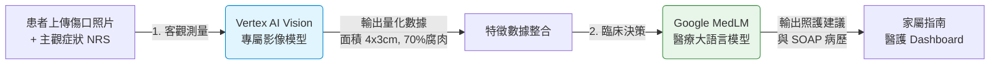

# 🩹 WoundCare V3 — 進階智慧醫療升級計畫 (Draft)

> **文件狀態**：規劃中 (Draft)
> **討論目標**：確立 V3 的核心發展方向、優先順序與技術選型。

---

## 1. V3 發展願景：從「紀錄追蹤」走向「主動醫療介入」

目前的 V2 版本已經成功建立了穩固的基底（多傷口管理、分類、歷程追蹤、基礎 AI 分析）。V3 的目標是讓系統更加 **「專業化」、「精準化」與「合規化」**，能夠為居家患者提供更安心的照護，並為診所/醫院提供高價值的遠距病歷資料。

---

## 2. 雲端技術策略：GCP 醫療級 API 雙引擎架構 (Sequential Pipeline)

為了達到真正的「醫療專家級」分析，V3 將捨棄單一通用模型，改採 **「先看診 (Vision) -> 後推理 (MedLM)」** 的雙大腦串接架構，確保診斷的客觀性與可追溯性。

### 🧠 雙引擎配置與分工

1. **第一階：Vertex AI Vision (扮演「長了醫療眼睛」的角色)**
   * **任務**：辨識傷口邊界、估算長寬面積、計算組織成分比例（紅色肉芽%、黃色腐肉%、黑色壞死%）。
   * **優勢**：比語言模型直接看圖更準確。生成的數據會存入資料庫，讓後續的醫療決策有跡可循（解決黑箱問題）。
2. **第二階：Google MedLM (扮演「有執照的主治醫師」的角色)**
   * **任務**：接收第一階的「客觀影像數據」+ 病患的「主觀症狀 (NRS=8/發燒)」，進行綜合推理。
   * **優勢**：在 USMLE 考試達專家水準，可以精準判斷癒合階段、給予專業敷料建議，並生成合規的 SOAP 紀錄。

### 💰 處理單張照片的成本預估 (Cost Estimation)

採用此雙引擎架構，在 GCP 上處理單次「傷口拍照 -> 完整 AI SOAP 產出」的成本極低，非常適合規模化：

* **1. Vertex AI Vision 影像特徵提取**：約 **$0.0015 ~ $0.005 USD** (取決於自訂模型大小與調用量)
* **2. MedLM 臨床推理生成**：(輸入歷史數據 + 輸出 SOAP 文字，約 1000 Tokens) 約 **$0.0005 ~ $0.002 USD**
* **綜合單次成本**：約 **$0.002 ~ $0.007 USD**（折合台幣約 **0.06 ~ 0.2 元** / 次）

> **💡 商業亮點**：相較於人工護理師審閱照片的成本，0.2 元的 AI 分析費用幾乎可忽略不計，為公司創造極大的利潤空間與規模化潛力。

---

## 3. 建議發展板塊 (Features)

以下是 V3 可以著手開發的核心方向，請依據商業價值與開發能量評估優先順序：

### 🌟 核心維度一：精準量化與趨勢分析
* **[A] AI 傷口輪廓追蹤與面積計算**：
  * **描述**：掃描照片時，系統自動辨識並框出傷口邊緣，估算長寬面積。
  * **價值**：在「照護歷程」中繪製「傷口縮小趨勢圖」，給予最客觀的癒合證據。
* **[B] 組織成分分析 (Wound Bed Preparation)**：
  * **描述**：辨識照片中的組織比例（如：70% 健康紅肉芽、30% 黃腐肉、0% 黑焦痂）。
  * **價值**：導入醫療級的評估標準，大幅提升產品專業信任度。

### 🛡️ 核心維度二：主動安全防護
* **[C] 感染紅旗警示系統 (Red Flag Alerts)**：
  * **描述**：當系統連續偵測到惡化跡象（如：NRS 疼痛指數連日上升、出現異常膿液、周圍紅腫擴大），主動跳出紅色警告。
  * **價值**：強烈建議患者就醫，降低延誤就醫風險與醫療糾紛。

### 🤝 核心維度三：商業變現與醫護整合
* **[D] 智慧敷料與保健品推薦 (Dressing & Supplement Recommendation)**：
  * **描述**：根據當下傷口狀態精準推播。例如：滲液多的發炎期推薦「藻酸鈣敷料」；癒合期推薦「高蛋白與維他命C」。
  * **價值**：完美結合公司現有的 Supplement Tracker 業務，創造電商或導購的變現潛力。
* **[E] 門診用 PDF 報告 / FHIR 對接**：
  * **描述**：患者就醫前，一鍵匯出「近兩週照護歷程與 AI SOAP」的精美 PDF 給醫師參考。未來亦可評估透過 FHIR 格式直接寫入醫院 HIS 系統。
  * **價值**：打通居家照護到醫療院所的最後一哩路。

---

## 4. 討論與確認事項 (Action Items)

請協助確認以下幾點，以便我們安排後續的實作順序：

- [ ] **技術授權**：確認公司的 GCP 帳號是否有申請並開通 MedLM 存取權限？
- [ ] **功能排序**：上述 `[A]` 到 `[E]` 五個功能中，近期最希望優先上線的是哪一到兩個？（例如：`[D]` 最有變現價值，或是 `[A]` 最能吸引用戶？）
- [ ] **其他需求**：是否有公司高層或是合作診所提出的特定 V3 需求未列在上面？
