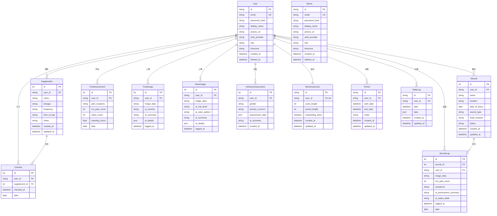

# ER 圖：核心使用者與健康照護模組

## 核心使用者 + 健康照護模組

## 說明

### 核心使用者
- **User**: 病患使用者，支援 LINE 與 Email 雙重認證
- **Admin**: 管理員使用者，用於後台 HQ 系統

### 健康照護模組
1. **保健品追蹤**: Supplement（保健品）+ CheckIn（打卡記錄）
2. **傷口照護**: Wound（傷口）+ WoundLog（照護日誌，含 AI 分析）
3. **足部照護**: FootAssessment（評估）+ FootImage（AI 影像分析）+ ShoeImage（鞋子磨損分析）
4. **親密健康**: IntimacyAssessment（評估問卷）
5. **經期追蹤**: MenstrualCycle（設定）+ Period（經期記錄）+ DailyLog（每日詳細記錄）

### 關鍵設計
- 所有模組都關聯到 `User`
- 支援軟刪除（`deleted_at`）
- AI 分析結果儲存在各模組的 Log 表中
