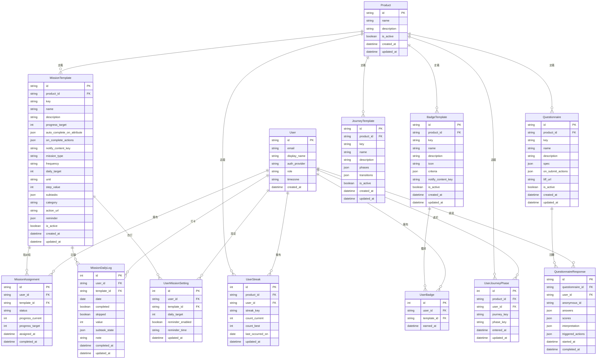

# ER 圖：遊戲化系統與問卷系統

## 遊戲化系統（Missions + Badges + Journeys）

## 說明

### 任務系統（Missions）
- **MissionTemplate**: 任務藍圖（定義任務規則）
  - 支援 4 種任務類型：`one_shot`、`binary_daily`、`quantitative_daily`、`checklist_daily`
  - 頻率：once、daily、weekly、monthly
  - 完成後可觸發動作（`on_complete_actions`）
- **MissionAssignment**: 使用者任務實例
  - 狀態：pending、completed、abandoned
  - 追蹤進度：`progress_current` / `progress_target`
- **MissionDailyLog**: 每日習慣打卡紀錄
  - 支援數值型（value）、子任務型（subtask_state）
  - 防重複：unique constraint on (user_id, template_id, date)
- **UserMissionSetting**: 使用者自訂設定（目標、提醒）
- **UserStreak**: 連續打卡紀錄（current streak、best streak）

### 徽章系統（Badges）
- **BadgeTemplate**: 徽章藍圖
  - 條件判斷：`criteria` JSON（如：連續打卡 7 天）
  - 圖示：emoji、URL 或 data URI
- **UserBadge**: 已獲得的徽章
  - 防重複：unique constraint on (user_id, template_id)

### 旅程系統（Journeys）
- **JourneyTemplate**: 旅程藍圖
  - `phases`: 階段定義（如：新手、進階、專家）
  - `transitions`: 轉換規則（觸發條件）
- **UserJourneyPhase**: 使用者當前所在階段
  - 追蹤進入時間和更新時間

### 問卷系統（Questionnaires）
- **Questionnaire**: 問卷定義
  - `spec`: 問卷結構（question_sets）
  - `on_submit_actions`: 提交後觸發動作（如：指派任務、設定屬性）
  - 支援 LIFF 嵌入（`liff_url`）
- **QuestionnaireResponse**: 問卷回覆
  - 支援匿名填寫（`anonymous_id`）
  - 自動計分和詮釋（`scores`、`interpretation`）

### 關鍵設計
- **Product-Scoped**: 所有模板都 scope 在 Product 層級，可跨 OA 共享
- **User-Specific**: 所有實例（Assignment、Badge、Phase、Response）都關聯到 User
- **自動化觸發**: 完成任務、獲得徽章、提交問卷都可觸發自動化動作
- **遊戲化機制**: 結合任務、徽章、連續打卡、旅程階段，提升使用者參與度
