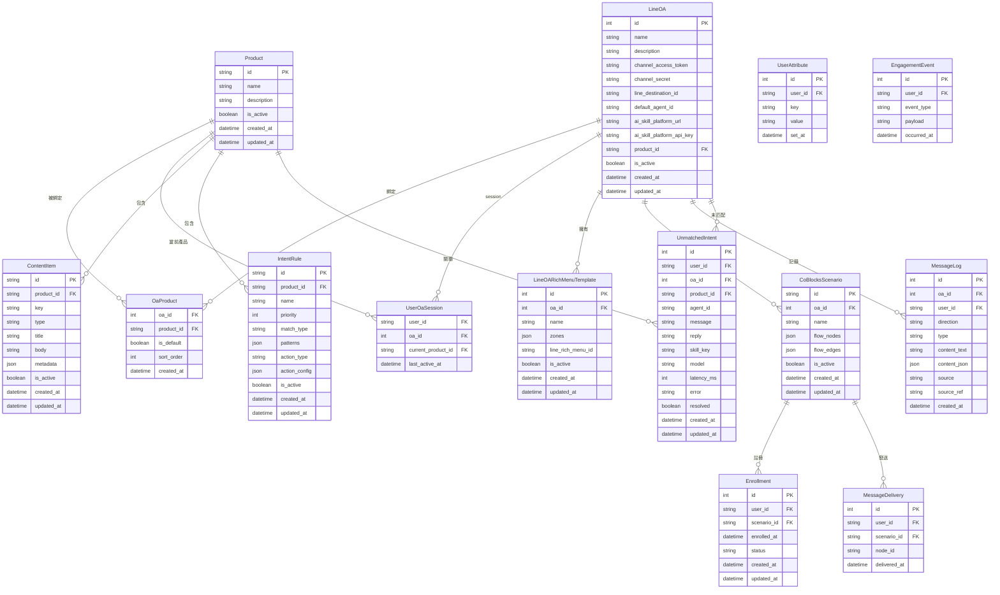

# ER 圖：LINE OA 平台與內容管理

## LINE OA 平台 + 產品 + 內容管理

## 說明

### LINE OA 平台架構
- **LineOA**: LINE 官方帳號，包含 channel token、AI agent 設定
- **Product**: 可共享的配置包（內容庫、任務、意圖規則等）
- **OaProduct**: N:N 關聯表，一個 OA 可綁定多個 Product
- **UserOaSession**: 使用者在特定 OA 中的當前產品上下文

### 內容管理系統
- **ContentItem**: 可分享的內容項目（文字、Flex、卡片）
- **IntentRule**: 意圖規則（關鍵詞匹配、正則表達式）
- 所有內容都 scope 在 Product 層級，可跨 OA 共享

### Rich Menu 與對話流程
- **LineOARichMenuTemplate**: LINE Rich Menu 模板
- **CoBlocksScenario**: 對話流程情境（節點+邊）
- **Enrollment**: 使用者註冊情境
- **MessageDelivery**: 訊息發送去重機制（防止重複推播）

### 訊息與互動追蹤
- **MessageLog**: 完整對話紀錄（inbound/outbound）
- **UnmatchedIntent**: 未匹配的使用者訊息（AI fallback）
- **UserAttribute**: 使用者屬性（key-value pairs）
- **EngagementEvent**: 語義事件追蹤

### 關鍵設計
- **多租戶架構**: 一個系統支援多個 LINE OA
- **配置共享**: Product 作為配置包，可被多個 OA 綁定
- **上下文管理**: UserOaSession 追蹤使用者當前使用的產品
