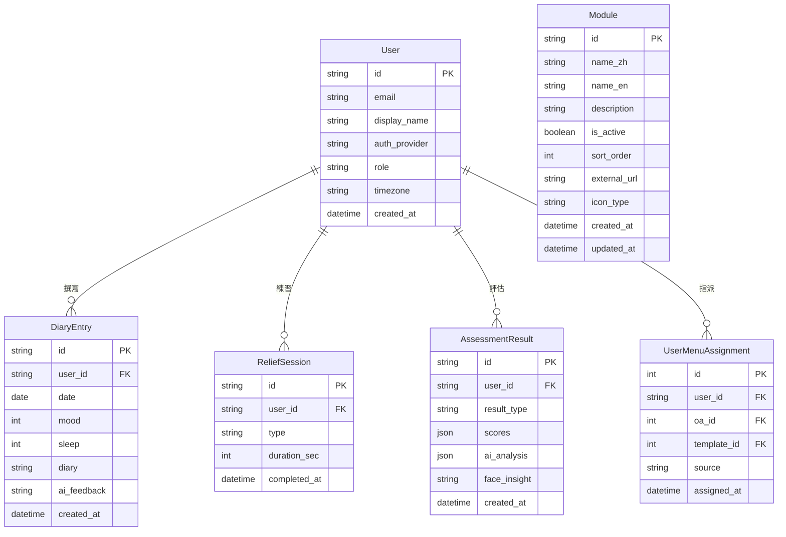

# ER 圖：女性療癒室與其他系統

## 女性療癒室專屬系統

## 說明

### 女性療癒室系統

#### DiaryEntry（日記記錄）
- **功能**: 使用者每日日記撰寫
- **欄位**:
  - `mood`: 心情評分（1-10）
  - `sleep`: 睡眠品質（1-10）
  - `diary`: 日記內容
  - `ai_feedback`: AI 回饋
- **Unique Constraint**: `(user_id, date)` - 每天只能寫一篇

#### ReliefSession（放鬆練習記錄）
- **類型**（ReliefType enum）:
  - `BREATHING`: 呼吸練習
  - `BODY_SCAN`: 身體掃描
  - `SLEEP_QUOTES`: 睡眠引導
- **追蹤**: 練習時長（`duration_sec`）和完成時間

#### AssessmentResult（評估結果）
- **功能**: 儲存心理/生理評估結果
- **欄位**:
  - `result_type`: 評估類型（如：焦慮、憂鬱等）
  - `scores`: 評分結果（JSON）
  - `ai_analysis`: AI 分析（JSON）
  - `face_insight`: 面部分析洞察

### 模組管理系統

#### Module（模組定義）
- **功能**: 定義系統中的各個功能模組
- **欄位**:
  - `name_zh` / `name_en`: 多語言名稱
  - `is_active`: 是否啟用
  - `sort_order`: 排序順序
  - `external_url`: 外部連結（如：period-tracker）
  - `icon_type`: 圖示類型

#### UserMenuAssignment（使用者 Menu 指派）
- **功能**: 管理使用者的 Rich Menu 分配
- **Unique Constraint**: `(user_id, oa_id)`
- **來源追蹤**: `source` 欄位記錄指派來源

### 關鍵設計
- **隱私優先**: 日記、心情、睡眠等敏感資料嚴格綁定使用者
- **AI 輔助**: 日記和評估都整合 AI 回饋功能
- **每日限制**: DiaryEntry 透過 unique constraint 確保每天只有一筆
- **模組化架構**: Module 表支援動態模組管理，方便新增/停用功能