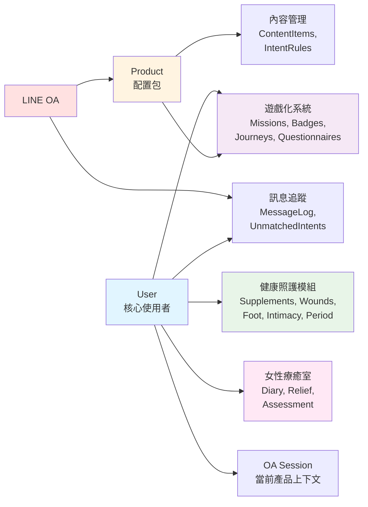

# Vitera 資料庫 ER 圖總覽

本文件包含 Vitera 專案完整的資料庫 Entity-Relationship (ER) 圖。

由於資料庫包含 50+ 張表格，為了清晰呈現，我們將 ER 圖分為以下四個部分：

---

## 📊 ER 圖分類

### 1. [核心使用者與健康照護模組](./er-diagram-core.md)

包含以下資料表：
- **核心使用者**: `users`, `admins`
- **保健品追蹤**: `supplements`, `check_ins`
- **傷口照護**: `wounds`, `wound_logs`
- **足部照護**: `foot_assessments`, `foot_images`, `shoe_images`
- **親密健康**: `intimacy_assessments`
- **經期追蹤**: `menstrual_cycles`, `menstrual_periods`, `menstrual_daily_logs`

**主要關係**:
- `User` 1:N 各種健康照護模組
- 各模組的 Log 表追蹤詳細記錄
- 支援 AI 影像分析

---

### 2. [LINE OA 平台與內容管理](./er-diagram-platform.md)

包含以下資料表：
- **LINE OA 平台**: `line_oa`, `products`, `oa_products`, `user_oa_sessions`
- **內容管理**: `content_items`, `intent_rules`
- **Rich Menu 與對話流程**: `line_oa_rich_menu_templates`, `coblocks_scenarios`, `enrollments`, `message_deliveries`
- **訊息與互動**: `message_log`, `unmatched_intents`, `user_attributes`, `engagement_events`

**主要關係**:
- `LineOA` N:N `Product`（透過 `oa_products`）
- `Product` 1:N 各種配置項目（內容、規則等）
- 完整的訊息追蹤與未匹配意圖記錄

**關鍵設計**:
- **多租戶架構**: 一個系統支援多個 LINE OA
- **配置共享**: Product 作為配置包，可被多個 OA 綁定
- **上下文管理**: UserOaSession 追蹤使用者當前使用的產品

---

### 3. [遊戲化系統與問卷系統](./er-diagram-gamification.md)

包含以下資料表：
- **任務系統**: `mission_templates`, `mission_assignments`, `mission_daily_logs`, `user_mission_settings`, `user_streaks`
- **徽章系統**: `badge_templates`, `user_badges`
- **旅程系統**: `journey_templates`, `user_journey_phases`
- **問卷系統**: `questionnaires`, `questionnaire_responses`

**主要關係**:
- `Product` 1:N 各種模板（Mission、Badge、Journey、Questionnaire）
- `User` 1:N 各種實例（Assignment、Badge、Phase、Response）
- 模板定義行為，實例追蹤使用者狀態

**關鍵設計**:
- **Product-Scoped**: 所有模板都 scope 在 Product 層級，可跨 OA 共享
- **自動化觸發**: 完成任務、獲得徽章、提交問卷都可觸發自動化動作
- **習慣追蹤**: 支援 4 種任務類型（one_shot、binary_daily、quantitative_daily、checklist_daily）

---

### 4. [女性療癒室與其他系統](./er-diagram-women-healing.md)

包含以下資料表：
- **女性療癒室**: `diary_entries`, `relief_sessions`, `assessment_results`
- **模組管理**: `modules`, `user_menu_assignments`

**主要關係**:
- `User` 1:N 日記、放鬆練習、評估結果
- 模組管理支援動態功能啟用/停用

**關鍵設計**:
- **隱私優先**: 敏感資料嚴格綁定使用者
- **AI 輔助**: 日記和評估都整合 AI 回饋功能
- **每日限制**: 日記透過 unique constraint 確保每天只有一筆

---

## 🔗 跨模組關係總覽

---

## 📝 重要設計原則

### 1. 多租戶架構
- 一個系統支援多個 LINE OA
- 透過 `line_oa.line_destination_id` 區分不同 OA 的 webhook

### 2. 配置共享（Product-Scoped）
- 內容、任務、徽章、旅程、問卷都 scope 在 `Product` 層級
- 多個 OA 可以綁定同一個 Product，實現配置共享
- 透過 `oa_products` 實現 N:N 關聯

### 3. 使用者上下文管理
- `user_oa_sessions` 追蹤使用者在特定 OA 中的當前產品
- 支援一個使用者在不同 OA 中使用不同產品

### 4. 遊戲化機制
- **任務系統**: 支援一次性、每日、每週、每月任務
- **徽章系統**: 達成條件後自動獲得徽章
- **連續打卡**: `user_streaks` 追蹤連續完成天數
- **旅程階段**: 根據進度自動轉換階段

### 5. AI 整合
- 傷口、足部、鞋子影像都支援 AI 分析
- 日記和評估支援 AI 回饋
- 未匹配意圖會觸發 AI fallback（Gemini + ADK）

### 6. 資料保護
- **Soft Delete**: `users` 與 `admins` 使用 `deleted_at` 標記
- **Cascade Delete**: 刪除使用者時自動清除所有相關資料
- **PII Compliance**: 遵循個人資料保護規範

---

## 🔍 快速查找

### 我想找...

- **使用者認證相關**: [核心使用者模組](./er-diagram-core.md) → `users`, `admins`
- **健康追蹤功能**: [核心使用者模組](./er-diagram-core.md) → supplements, wounds, foot, intimacy, period
- **LINE OA 設定**: [LINE OA 平台](./er-diagram-platform.md) → `line_oa`, `products`, `oa_products`
- **內容管理**: [LINE OA 平台](./er-diagram-platform.md) → `content_items`, `intent_rules`
- **任務與習慣**: [遊戲化系統](./er-diagram-gamification.md) → `mission_templates`, `mission_assignments`, `mission_daily_logs`
- **徽章成就**: [遊戲化系統](./er-diagram-gamification.md) → `badge_templates`, `user_badges`
- **問卷調查**: [遊戲化系統](./er-diagram-gamification.md) → `questionnaires`, `questionnaire_responses`
- **日記與療癒**: [女性療癒室](./er-diagram-women-healing.md) → `diary_entries`, `relief_sessions`
- **訊息記錄**: [LINE OA 平台](./er-diagram-platform.md) → `message_log`, `unmatched_intents`

---

## 📚 相關文件

- [Database Schema 詳細說明](./database-schema.md) - 完整的資料表欄位說明
- [API 端點參考](./api-endpoints.md) - 對應的 API 設計
- [架構總覽](../explanation/architecture-overview.md) - 系統整體架構

---

**最後更新**: 2026-05-17
