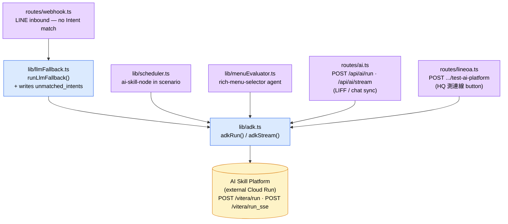
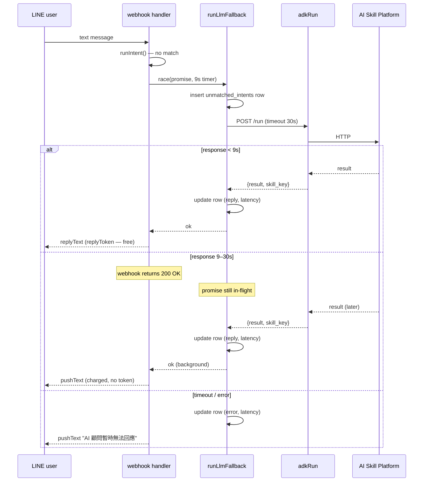
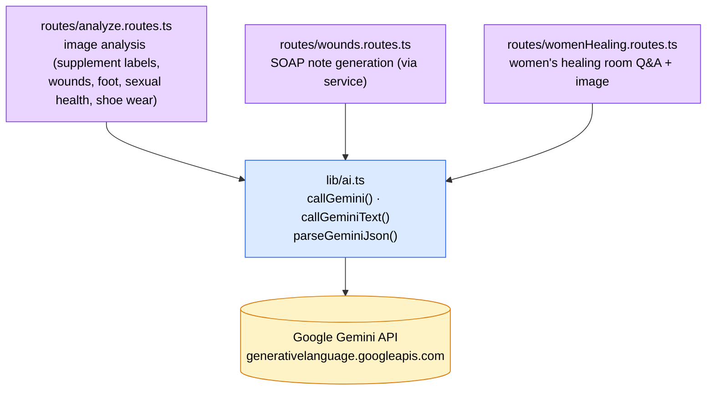

# LLM Architecture

How Vitera talks to LLMs. Two independent chains, different jobs, no shared state.

## A. AI Skill Platform (chat / ops-managed agents)

Externally hosted FastAPI service (`ai-skill-platform-staging-*.run.app`). Each OA stores its own URL + bearer token + default agent. Wrapped by `backend/src/lib/adk.ts` — calls `POST <url>/vitera/run` and `POST <url>/vitera/run_sse` with header `Authorization: Bearer <token>`.

### Webhook fast-path / slow-path

## B. Gemini direct (multimodal / structured extraction)

`backend/src/lib/ai.ts` — calls `https://generativelanguage.googleapis.com/.../models/<model>:generateContent` with the global `GEMINI_API_KEY`. Multi-model fallback list (嘗試順序)：

1. `gemini-3.1-flash-lite-preview`
2. `gemini-3-flash-preview`
3. `gemini-2.5-flash-lite`
4. `gemini-2.5-flash`
5. `gemini-flash-lite-latest`
6. `gemini-flash-latest`

## When to use which

| Scenario | Chain | Why |
|---|---|---|
| LINE chat smart reply | A. AI Skill Platform | Multi-agent, conversation memory, ops tweaks prompt without redeploy |
| Image analysis / structured extraction | B. Gemini direct | Multimodal, JSON output, no conversation context needed |
| Scheduled `ai-skill-node` push | A. AI Skill Platform | Scenario already pins which agent for which day |
| Rich menu auto-switching | A. AI Skill Platform | Uses `rich-menu-selector` agent to decide |
| HQ "測連線" button | A. AI Skill Platform | Same path as webhook fallback — green = real users get real answers |

## Auditing surface

- **`unmatched_intents` table** — only the webhook fallback path writes here. Every inbound text that didn't match an Intent rule shows up: question, reply, agent, skill_key, latency, error, `resolved` flag for ops.
- **`message_log`** — every outbound LINE message regardless of source. AI replies have `source='ai_agent'` and `source_ref=<agent_id>` (or `<agent_id>:slow`, `<agent_id>:error`).
- **`message_deliveries`** — at-most-once dedup for scheduler `ai-skill-node` pushes.

The other three Chain-A callers (scheduler, menuEvaluator, `/api/ai/run`) only console-log on failure. They're not user-feedback contexts so we don't write `unmatched_intents` rows for them.

## Per-OA config

Stored on `LineOA` row, edited at HQ → OA → Settings tab:

| Column | Used by | Notes |
|---|---|---|
| `ai_skill_platform_url` | All Chain-A callers | OA-scoped — different products can point at different platforms |
| `ai_skill_platform_api_key` | All Chain-A callers | Pre-signed bearer token, sent as `Authorization: Bearer <token>` header |
| `default_agent_id` | webhook fallback, lineoa test | Per-scenario `ai-skill-node` overrides this for its day window |

Gemini chain (B) reads `GEMINI_API_KEY` from process env — not per-OA.
