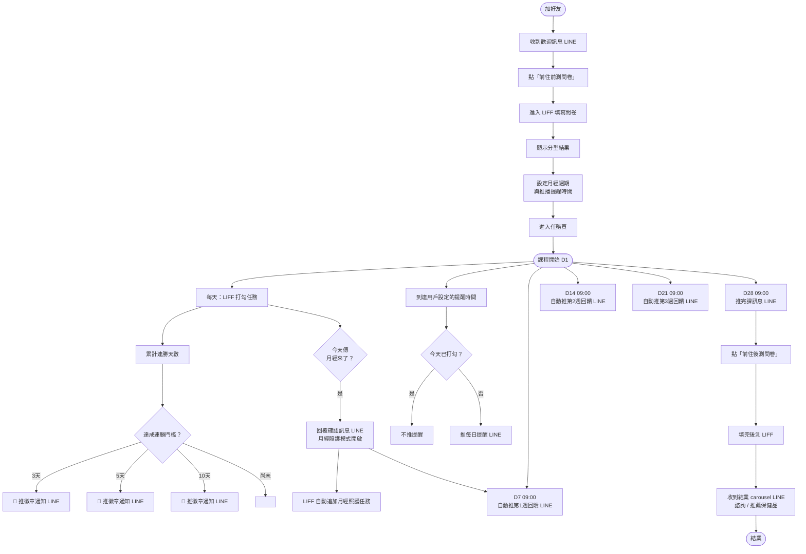

# 女性保健小課程 — User Journey 完整機制文件

> 版本：2026-05-14　|　適用環境：Vitera 平台（LINE OA + LIFF）

---

## 目錄

1. [名詞解釋](#名詞解釋)
2. [整體流程總覽](#整體流程總覽)
3. [階段一：加好友 → 完成前測](#階段一加好友--完成前測)
4. [階段二：課程進行中（D1–D28）](#階段二課程進行中-d1d28)
5. [階段三：完課 → 後測 → 結業](#階段三完課--後測--結業)
6. [特殊觸發：月經回報](#特殊觸發月經回報)
7. [每日任務與打勾機制](#每日任務與打勾機制)
8. [連勝與徽章系統](#連勝與徽章系統)
9. [系統間的資料同步](#系統間的資料同步)
10. [所有 LINE 推播訊息彙整](#所有-line-推播訊息彙整)
11. [待建功能（尚未完成）](#待建功能尚未完成)

---

## 名詞解釋

| 名詞 | 說明 |
|------|------|
| **LINE OA** | 用戶與課程互動的主介面，傳文字觸發 Intent Rule |
| **LIFF** | 嵌入在 LINE 裡的 Web App，顯示任務清單、問卷、徽章 |
| **IntentRule** | 後端的關鍵字比對規則，收到特定關鍵字後執行對應動作 |
| **UserAttribute** | 用戶的 key-value 狀態存儲（例如 `course_started=yes`） |
| **JourneyTemplate** | 課程的階段設定（active → completed）|
| **MissionDailyLog** | 用戶每天任務打勾的紀錄 |
| **UserStreak** | 用戶連勝天數紀錄（`wh_daily_checkin`）|
| **BadgeTemplate** | 徽章的條件設定（達到連勝門檻即發放）|
| **phaseDailyPush** | 每 5 分鐘執行的 cron，負責 D7/14/21/28 的自動推播 |
| **reminders** | 每日提醒的 cron，根據用戶設定時間判斷是否推播 |

---

## 整體流程總覽



---

## 階段一：加好友 → 完成前測

### 1-1. 加好友觸發

**觸發條件：** 用戶第一次加 LINE OA 好友（Follow 事件）

**後端動作：**
- 建立用戶資料
- 自動推送 `wh_welcome_msg`（歡迎訊息 Flex Message）

**用戶在 LINE 看到：**
> 🌸 歡迎加入 28 天女性保健小課程！
> 我們將陪伴妳建立屬於自己的女性保健習慣。
> 第一步，先完成前測問卷，讓我們了解妳的身體狀況 💗
> **[前往前測問卷 →]**（按鈕，開啟 LIFF）

---

### 1-2. 用戶傳關鍵字（補入口）

用戶若沒立刻點，可以之後傳關鍵字重新拿到入口：

| 用戶傳送 | 後端比對 | 回應 |
|---------|---------|------|
| 前測、問卷、開始課程、我要開始 | IntentRule「前測入口」| 重發 `wh_welcome_msg` |
| 任務、今日任務、今天任務、checklist | IntentRule「查看任務」| 發 `wh_daily_task_reminder` |

---

### 1-3. 完成前測問卷（LIFF）

**觸發條件：** 用戶在 LIFF 填完前測問卷並送出

**LIFF 寫入後端：**

```
UserAttribute: course_start_date = "2026-05-14"  ← 用戶選「今天開始」則是今天，選「明天開始」則是明天
UserAttribute: course_started = "yes"
```

**後端自動觸發（JourneyTemplate transition）：**
- 偵測到 `course_started = yes` → 用戶進入 Journey 的 **active phase**
- D1 起算基準 = `course_start_date`（LIFF 問卷中選擇的日期）

---

## 階段二：課程進行中（D1–D28）

### 2-1. D7 / D14 / D21 / D28 自動推播

由 `phaseDailyPush` cron（每 5 分鐘執行）負責。

**計算邏輯：**
```
day_in_phase = floor(今天日期 - course_start_date) + 1
```

**推播時間：** 每天 09:00（依用戶時區計算）

| 第幾天 | 推播內容 | 訊息 key |
|--------|---------|---------|
| D7 | 第 1 週完成回饋 + 第 2 週主題預告 | `stage_feedback_d7` |
| D14 | 第 2 週完成回饋 + 第 3 週主題預告 | `stage_feedback_d14` |
| D21 | 第 3 週完成回饋 + 第 4 週主題預告 | `stage_feedback_d21` |
| D28 | 完課訊息 + 後測 CTA | `completion_d28` |

**防重複機制：** 每筆推播會在 DB 寫入 `source_ref = journey:active:day_N:日期`，同一天不會重複推。

---

### 2-2. 每日任務提醒（reminders cron）

**觸發條件：** 到達用戶設定的提醒時間，且當天尚未完成任務

**判斷邏輯：**
1. 查看用戶設定的提醒時間（UserAttribute 或系統預設）
2. 查詢 `MissionDailyLog`：今天是否已有 `completed = true` 的紀錄
3. **已完成 → 跳過，不推**
4. **未完成 → 推 `wh_daily_task_reminder`**

**用戶在 LINE 看到：**
> 📋 今天的任務還沒完成喔！
> 每一個小習慣都是妳給身體最好的禮物。點下方按鈕查看今日 Checklist 吧 ✨
> **[查看今日任務 →]**（按鈕，開啟 LIFF 任務頁）

---

## 階段三：完課 → 後測 → 結業

### 3-1. D28 完課訊息

**推播時間：** D28 當天 09:00（由 phaseDailyPush 觸發）

**用戶在 LINE 看到：**
> 🎓 恭喜完課！妳完成了 28 天女性保健小課程！
> ① 完成後測，看看妳的進步
> ② 預約一對一，讓醫師為妳解答
> ③ 使用折扣碼 WOMEN0 領取 0 元保健品
>
> **[前往後測問卷 →]** **[預約一對一諮詢]** **[領取 0 元保健品]**

---

### 3-2. 完成後測（LIFF）

**觸發條件：** 用戶在 LIFF 填完後測問卷並送出

**LIFF 寫入後端：**
```
UserAttribute: course_completed = "yes"
```

**後端自動觸發：**
- 偵測到 `course_completed = yes` → Journey 從 `active` 轉入 **completed phase**
- 立即推送 `posttest_completed`（carousel，3 張卡）

**用戶在 LINE 看到（carousel 3 張）：**

| 卡片 | 內容 |
|------|------|
| 卡 1 | ✨ 後測完成！了解自己，是照顧自己的第一步。 |
| 卡 2 | 🌿 精準保健規劃 + **[預約一對一諮詢 →]** |
| 卡 3 | 💊 推薦保健品 + **[查看推薦保健品 →]** |

---

## 特殊觸發：月經回報

### 觸發條件

用戶在 LINE 傳送以下任一關鍵字：
- 月經來了、月經開始、MC來了、mc來了、我月經來了、生理期來了

### 後端動作（三件事同時發生）

1. **寫入 UserAttribute**
   ```
   period_state = "menstrual"
   ```

2. **回覆確認訊息**（LINE 立即回應 `period_started_ack`）
   > 收到 🩸 月經照護模式開啟！
   > 今天的任務清單已自動追加「月經照護」小任務，好好照顧自己 💗

3. **（待建）同步 period-tracker**
   - 自動在 `menstrual_periods` 表建立一筆經期紀錄（`start_date = 今天`）
   - 用戶不需要再到 period-tracker 手動標記

### LIFF 更新（待建）

- LIFF 任務頁載入時，若偵測到 `period_state = menstrual`，自動在當天 Checklist 注入「月經照護」任務群組

---

## 每日任務與打勾機制

### 任務從哪裡來

本課程的任務內容**完全由 LIFF 管理**，後端 `missions: []` 為空。
LIFF 根據課程天數（D1–D28）顯示對應的任務清單。

### 打勾流程（待建 API）

```
用戶在 LIFF 點打勾
  ↓
LIFF 呼叫後端 API（待建）
  PATCH /api/missions/:templateId/daily-log
  ↓
後端寫入 MissionDailyLog.completed = true
後端呼叫 incrementStreak(productId, userId, 'wh_daily_checkin')
  ↓
系統評估連勝徽章（evaluateStreakBadges）
若達門檻 → 推 LINE 徽章通知
```

### 對每日提醒的影響

當天打勾完成後，`reminders` cron 到達提醒時間時，查到 `MissionDailyLog.completed = true`，**自動跳過不推**。

---

## 連勝與徽章系統

### 連勝計算

- **streak_key：** `wh_daily_checkin`
- **計算單位：** 日曆天（依用戶時區）
- **中斷規則：** 超過 1 天沒打勾，連勝歸零
- **同天重複：** 無效，不重複計算

### 徽章設定

| 徽章 | icon | 連勝門檻 | LINE 推播 |
|------|------|---------|----------|
| 3 日初芽 | 🌱 | 3 天 | ✅ 推（`wh_badge_3d`）|
| 5 日開花 | 🌸 | 5 天 | ✅ 推（`wh_badge_5d`）|
| 10 日盛放 | 🌺 | 10 天 | ✅ 推（`wh_badge_10d`）|
| 28 日圓滿 | 🏆 | 28 天 | ❌ 不推（D28 當天已有完課訊息，避免重複）|

### 徽章推播訊息範例（以 5 日開花為例）

> 🌸 徽章解鎖！
> **5 日開花**
> 5 天了！妳做到了 🎉
> 研究顯示，連續 5 天養成習慣，大腦已經開始記住這個節奏。下一站：10 天盛放！
> **[查看我的徽章 →]**（連到 LIFF profile 頁）

### LIFF 顯示

所有已獲得的徽章在 LIFF 個人頁（`/profile`）顯示，包含 28 日圓滿。

---

## 系統間的資料同步

```
┌─────────────────────────────────────────────────────────────┐
│                        用戶操作                              │
└────────────┬──────────────────────┬──────────────────────┘
             │ LINE 傳訊息           │ LIFF 操作
             ↓                      ↓
     ┌──────────────┐      ┌──────────────────┐
     │  IntentRule  │      │   LIFF 前端       │
     │  比對引擎    │      │ (women-health)    │
     └──────┬───────┘      └────────┬─────────┘
            │                       │
            ↓                       ↓
     ┌────────────────────────────────────────┐
     │              Vitera 後端 API            │
     │                                        │
     │  UserAttribute   MissionDailyLog       │
     │  UserStreak      BadgeTemplate         │
     │  UserJourney     ContentItem           │
     └────────────────────────────────────────┘
            │                       │
            ↓                       ↓
     ┌──────────────┐      ┌──────────────────┐
     │  LINE Push   │      │  period-tracker  │
     │  Message API │      │  DB（待串接）    │
     └──────────────┘      └──────────────────┘
```

### 關鍵資料流

| 事件 | 寫入 | 讀取 |
|------|------|------|
| LIFF 完成前測 | `course_start_date`, `course_started=yes` | phaseDailyPush（計算 D 幾）|
| LIFF 任務打勾 | `MissionDailyLog.completed=true` | reminders（判斷是否推提醒）|
| LIFF 任務打勾 | `UserStreak.count_current++` | BadgeTemplate（評估是否發徽章）|
| LINE 傳「月經來了」| `period_state=menstrual` | LIFF（動態注入月經照護任務）|
| LIFF 完成後測 | `course_completed=yes` | JourneyTemplate（觸發 active→completed）|

---

## 所有 LINE 推播訊息彙整

| # | 訊息 key | 觸發點 | 類型 |
|---|---------|--------|------|
| 1 | `wh_welcome_msg` | 加好友 / 傳關鍵字 | Flex（1 卡）|
| 2 | `wh_daily_task_reminder` | 每日提醒 cron / 傳「任務」| Flex（1 卡）|
| 3 | `stage_feedback_d7` | D7 09:00（cron）| Flex（1 卡）|
| 4 | `stage_feedback_d14` | D14 09:00（cron）| Flex（1 卡）|
| 5 | `stage_feedback_d21` | D21 09:00（cron）| Flex（1 卡）|
| 6 | `completion_d28` | D28 09:00（cron）| Flex（1 卡）|
| 7 | `posttest_completed` | 完成後測（LIFF）| Flex Carousel（3 卡）|
| 8 | `period_started_ack` | 傳「月經來了」| 純文字 |
| 9 | `recall_inactive` | 喚回推播（手動或未來 cron）| 純文字 |
| 10 | `wh_badge_3d` | 連勝達 3 天（自動）| Flex（1 卡）|
| 11 | `wh_badge_5d` | 連勝達 5 天（自動）| Flex（1 卡）|
| 12 | `wh_badge_10d` | 連勝達 10 天（自動）| Flex（1 卡）|

> 28 日圓滿徽章（`wh_streak_28d`）**不推 LINE**，只在 LIFF 顯示。

---

## 待建功能（尚未完成）

以下功能已在需求中確認，但尚未實作：

### 🔴 必要（影響核心流程）

| 功能 | 說明 |
|------|------|
| **LIFF 打勾 API** | `PATCH /api/missions/:templateId/daily-log`，打勾後寫 `MissionDailyLog.completed=true`，同時呼叫 `incrementStreak('wh_daily_checkin')` |
| **LIFF 任務頁** | 顯示當天 Checklist、打勾互動 |
| **LIFF 前測問卷** | 填完後寫入 `course_start_date` 和 `course_started=yes` |
| **LIFF 後測問卷** | 填完後寫入 `course_completed=yes`，觸發 Journey 完課 |
| **置換上線 URL** | `LIFF_BASE`、`SHOP_URL`、`BOOKING_URL` 目前是 placeholder，上線前需換成正式 URL |

### 🟡 重要（提升體驗）

| 功能 | 說明 |
|------|------|
| **月經照護任務動態注入** | LIFF 任務頁偵測 `period_state=menstrual`，自動追加月經照護任務群組 |
| **LIFF 個人頁（徽章展示）** | `/profile` 頁顯示已獲得的徽章、當前連勝天數 |
| **period-tracker 自動同步** | 用戶回報月經時，自動在 `menstrual_periods` 表建立紀錄 |
| **喚回 cron** | N 天未打開 LIFF 的用戶自動發 `recall_inactive` |
| **用戶自訂提醒時間** | 在 LIFF 設定每日任務提醒的時間點 |


---

*文件由 Chloe Chu / Claude Code 整理，依據 `backend/src/lib/seedTemplates.ts`、`phaseDailyPush.ts`、`reminders.ts`、`intent.ts`、`gamification.ts` 的實際程式碼。*
